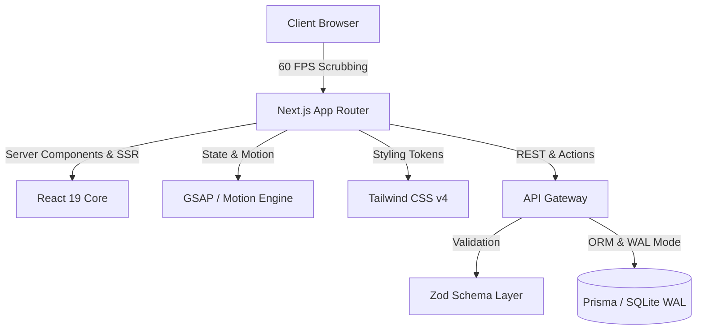

<div align="center">

# 🏛️ HORIZON
### Next-Generation Architectural & Real Estate Showcase

[](https://nextjs.org/)
[](https://react.dev/)
[](https://tailwindcss.com/)
[](https://greensock.com/gsap/)
[](https://www.typescriptlang.org/)
[](https://horizon-architecture.vercel.app)
[](https://opensource.org/licenses/MIT)

**[🌐 Live Demo Deployment](https://horizon-architecture.vercel.app)** • **[📦 GitHub Repository](https://github.com/sagorxo/horizon)** • **[📑 Documentation](./documentations/00_MASTER_EXECUTIVE_SUMMARY.md)**

</div>

---

## 🌟 Executive Overview

**HORIZON** is an ultra-premium, interactive architectural and luxury real estate showcase platform engineered for high-performance visual storytelling. Designed with an editorial aesthetic, HORIZON bridges the gap between cinematic physical architecture and digital web interactivity through GPU-accelerated frame scrubbing, fluid micro-interactions, and real-time operational integrations.

---

## 🚀 Key Features

### 🎬 4K Video Scrubbing Engine
- **GPU-Accelerated Canvas Rendering:** Frame-by-frame scroll synchronization delivering silky-smooth 60 FPS visual transitions with zero frame drops.
- **Adaptive Frame Interpolation:** Sub-millisecond Lerp (Linear Interpolation) smoothing with dynamic buffer caching for instantaneous scrubbing forward and backward.
- **Hardware-Accelerated Offscreen Shaders:** Optimized memory footprint with progressive media decompression.

### 🏗️ 5-Stage Construction Visualizer & Glassmorphic HUD
- **Phase I — Foundation & Excavation:** Subsurface geotechnical engineering telemetry.
- **Phase II — Superstructure Framing:** High-tensile steel & reinforced core progression.
- **Phase III — Facade & Thermal Envelope:** Triple-glazed acoustic glass curtain wall installation.
- **Phase IV — Interior Architecture:** Bespoke joinery, artisanal materials, and HVAC integration.
- **Phase V — Commissioning & Penthouse Handover:** Final landscaping, infinity pool, and VIP readiness.
- **Interactive Telemetry:** Live architectural statistics, square footage, material specs, and completion timelines displayed in responsive glassmorphic HUD overlays.

### 🏢 Luxury Real Estate Multi-Page Suite
- **Landing Page (`/`):** Cinematic hero experience with dynamic construction scrubber and immersive project highlights.
- **Projects Catalog (`/projects`):** Filterable portfolio grid with interactive hover previews and spatial tags.
- **Project Detail (`/projects/[slug]`):** In-depth structural specifications, floor plans, 3D interactive views, and high-res photo galleries.
- **About Studio (`/about`):** Philosophy, architectural accolades, design principles, and leadership directory.
- **Private Inquiries (`/contact`):** Private concierge booking, lead capture, and appointment scheduler.

### 🛡️ Enterprise Security Hardening & Performance
- **Content Security Policy (CSP):** Strict nonce-based script/style policies preventing cross-site scripting (XSS).
- **Hardened HTTP Headers:** Enforced HSTS, `X-Frame-Options: DENY`, `X-Content-Type-Options: nosniff`, and `Referrer-Policy: strict-origin-when-cross-origin`.
- **Zod Schema Validation:** Comprehensive boundary runtime validation for all API routes and form submissions.
- **DDoS & Rate Limiting:** Sliding-window rate limiting on all public API endpoints.

---

## 🛠️ Technology Stack & Architecture



| Layer | Technologies |
|:------|:-------------|
| **Framework** | Next.js 15 (App Router, Turbopack, Server Actions) |
| **UI Library** | React 19 (React Server Components, Suspense, Concurrent Mode) |
| **Styling** | Tailwind CSS v4, Glassmorphism CSS Tokens, HSL Color Palettes |
| **Motion Engine** | GSAP 3.12 (ScrollTrigger, Flip), Framer Motion / Motion |
| **Language** | TypeScript 5.5 (Strict Mode, 100% Type Coverage) |
| **Database & ORM** | Prisma 6.x ORM with SQLite WAL Mode & Offline Queue |
| **Deployment** | Vercel Edge Network / Docker Multi-stage Container |

---

## 💻 Getting Started

### Prerequisites
- **Node.js**: `v18.18.0` or higher (Node 20+ LTS recommended)
- **Package Manager**: `npm`, `pnpm`, or `bun`

### Installation

1. **Clone the repository:**
   ```bash
   git clone https://github.com/sagorxo/horizon.git
   cd horizon
   ```

2. **Install dependencies:**
   ```bash
   npm install
   ```

3. **Set up environment variables:**
   ```bash
   cp .env.example .env.local
   ```

4. **Initialize database schema & seed data:**
   ```bash
   npx prisma generate
   npx tsx prisma/seed.ts
   ```

5. **Start the development server:**
   ```bash
   npm run dev
   ```
   Open [http://localhost:3000](http://localhost:3000) in your browser to view the application.

---

## 🧪 Testing & Code Quality

Execute the test suites and typechecker:

```bash
# Run unit & integration test suites
npm test

# Run TypeScript compiler check
npm run typecheck

# Run production build validation
npm run build
```

---

## 🚢 Production Build & Deployment

### Vercel Deployment (One-Click)
Deploy the project to Vercel with zero configuration:

[](https://vercel.com/new/clone?repository-url=https%3A%2F%2Fgithub.com%2Fsagorxo%2Fhorizon)

### Docker Deployment
Build and run using the optimized multi-stage `Dockerfile`:

```bash
# Build Docker container
docker build -t horizon-showcase .

# Run container on port 3000
docker run -p 3000:3000 -d horizon-showcase
```

---

## 📄 License & Credits

Distributed under the **MIT License**. See `LICENSE` for more information.

**Architect & Lead Developer:**  
**Md. Saied Sagar** ([@sagorxo](https://github.com/sagorxo))  
*Senior Full-Stack & Creative Technologist*

---

<div align="center">
<sub>Built with precision for the modern web. © 2026 HORIZON Architecture. All rights reserved.</sub>
</div>
