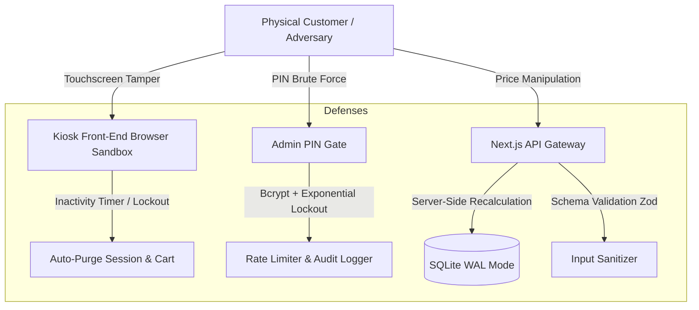

# MY GERMAN DÖNER — Kiosk/POS Security & Disaster Recovery SOP
## (`architecture/security_and_disaster_recovery.md`)

> **Document Version:** 1.0.0  
> **Classification:** Enterprise Production Architecture  
> **Last Updated:** 2026-08-15T19:20:00+03:00

---

## 1. Executive Summary & Philosophy

Self-service food ordering kiosks operate in an **unsupervised physical environment** under hostile conditions: public touchscreens, curious customers, potential tampering, erratic internet connections, sudden power cutouts, and intense peak rush hours.

Our security and resilience architecture enforces three core mandates:
1. **Zero-Trust Boundaries:** Never trust client-side prices, calculated totals, or hardware states. Every transaction is cryptographically and logically validated on the local server.
2. **Survive the "Unplugged Cord":** If power is ripped from the kiosk or network router at any millisecond of a transaction, zero state corruption occurs, and financial reconciliation is preserved.
3. **Graceful Failover:** When hardware peripherals (e.g. thermal receipt printers, network cards, payment PIN pads) malfunction, the kiosk dynamically falls back to alternate channels (screen-only receipts, dual printer switch, cashier cash queue) without crashing.

---

## 2. Threat Modeling & Defense Vectors



### 2.1 Threat Vector 1: Client-Side Price Tampering
- **Attack:** An attacker intercepts or alters client-side JavaScript state (e.g., modifying `CartItem.basePrice` from €6.50 to €0.01 via browser console or crafted payload).
- **Defense:**
  1. The API route (`/api/orders/create`) **completely ignores** `basePrice` and `totalPrice` passed in the client JSON.
  2. The server queries the SQLite database directly for the current valid price of each `productId` and `modifierId` for that specific store `locationId`.
  3. Server computes `subtotal`, 19% Cyprus VAT, and `totalAmount` in a single ACID transaction.
  4. If any price discrepancy exceeds €0.00, the request is rejected with audit logging (`SEVERITY: CRITICAL`).

### 2.2 Threat Vector 2: Kiosk Breakout & Physical DevTools Access
- **Attack:** User attempts keyboard shortcuts (e.g., F12, Ctrl+Shift+I, Alt+Tab, Cmd+Space) or multitouch gesture exploits (pinch-zoom, long-press text selection) to escape the kiosk browser sandbox into the underlying OS.
- **Defense:**
  1. CSS hardening: `user-select: none; -webkit-user-select: none; touch-action: pan-y;` on the root viewport.
  2. Browser context: Chrome/Electron running in `--kiosk --no-first-run --disable-context-menu --disable-pinch --overscroll-history-navigation=0`.
  3. Event suppression: React top-level listener intercepts `contextmenu`, `dragstart`, `selectstart`, and devtool keydown codes (`F1` through `F12`).
  4. Auto-lock watchdog: Background daemon restarts the kiosk process if the browser loses focus.

### 2.3 Threat Vector 3: Inactivity Cart Abandonment & Session Hijacking
- **Attack:** Customer leaves half-ordered cart on screen containing modified items or personal notes; next customer accidentally pays for abandoned items.
- **Defense:**
  1. 60-second idle countdown timer triggers a modal popup: *"Are you still there? Tap to continue"*.
  2. If untouched for another 15 seconds, cart state, customer notes, and payment intents are completely wiped.
  3. Screen smoothly resets to the **Attract Screen** in the store's default locale.

### 2.4 Threat Vector 4: Admin PIN Brute-Forcing
- **Attack:** Unauthorized user repeatedly inputs 4-digit codes on the staff settings modal to access menu pricing and terminal configuration.
- **Defense:**
  1. Admin PIN stored as high-cost **Bcrypt hash** (salt rounds: 12) in SQLite.
  2. Progressive rate-limiting:
     - 3 failed attempts: 30-second delay.
     - 5 failed attempts: 5-minute terminal lock with alert logged to `AuditLog`.
     - 10 failed attempts: Kiosk displays *"Terminal Locked — Contact Store Manager"*.

---

## 3. Worst-Case Scenarios & Disaster Recovery Matrix

| Scenario | Impact | Autonomous Recovery Procedure | Manual Failover |
|:---|:---|:---|:---|
| **Sudden Power Outage Mid-Payment** | Kiosk dies while customer card is tapped | 1. SQLite WAL mode ensures zero file corruption on restart.<br>2. On boot, terminal checks payment gateway for orphaned transactions via idempotent `orderNumber`.<br>3. If uncaptured, marked `CANCELLED`; if captured, auto-prints receipt on boot. | Cashier verifies terminal reference on POS |
| **Receipt Printer Out of Paper / Jammed** | Customer has paid but receives no physical ticket | 1. Kiosk detects printer status code `0x08` (Paper Out / Offline).<br>2. Kiosk displays giant on-screen receipt with bold order number `EMBA-20260815-1423-047` and QR code for mobile capture.<br>3. Flashes friendly message: *"Please take a photo of your order number!"*<br>4. Automatically reroutes ticket to secondary printer if configured. | Cashier looks up order in POS queue by timestamp |
| **Total Internet Loss (Offline Mode)** | Router disconnected or ISP fiber down | 1. Kiosk operates 100% locally using local SQLite.<br>2. Cash, Card (stored offline transactions / local PIN pad terminal), and local QR codes continue without interruption.<br>3. Orders are enqueued into `SyncQueue` with status `PENDING`.<br>4. Background sync worker automatically drains queue when DNS resolves. | None required — fully autonomous |
| **Database Corruption on Sudden Crash** | SQLite file header corrupted | 1. Automated startup script runs `PRAGMA integrity_check;`.<br>2. If error detected, moves damaged DB to `prisma/data/corrupt_[timestamp].db`.<br>3. Restores from latest daily snapshot `prisma/data/kiosk_pos_backup.db`.<br>4. Replays sync log to restore missing today orders. | Run `npm run db:restore` from admin terminal |
| **Product Out-of-Stock Mid-Order** | Manager marks "Chicken" sold out while customer is customizing | 1. On "ADD TO CART" or "PROCEED TO PAYMENT", API checks real-time `isAvailable` flag.<br>2. If unavailable, returns HTTP 409 Conflict with item details.<br>3. UI displays modal: *"Classic Döner (Chicken) just sold out! Would you like Beef/Lamb or Falafel instead?"*<br>4. Preserves other cart items. | Customer switches meat choice in 1 tap |
| **Dual Printer Driver Incompatibility** | Epson TM printer replaced with Star Micronics | 1. Admin panel contains instant driver switch toggle.<br>2. ESC/POS (Epson) vs StarPRNT / Line Mode formatters are loaded dynamically.<br>3. Single click sends test print page to verify cutter and feed. | Toggle setting in `/admin/settings` |

---

## 4. SQLite WAL Mode Configuration SOP

SQLite in standard rollback journal mode can lock during concurrent reads/writes. To guarantee enterprise multi-reader/single-writer performance:

```sql
-- Executed on database connection initialization
PRAGMA journal_mode = WAL;
PRAGMA synchronous = NORMAL;
PRAGMA foreign_keys = ON;
PRAGMA busy_timeout = 5000;
PRAGMA cache_size = -64000; -- 64MB cache
PRAGMA temp_store = MEMORY;
```

---

## 5. Security Checklist Before Production Deployment

- [ ] `.env` is listed in `.gitignore` and has no checked-in production secrets
- [ ] Database path is set to persistent Docker volume (`/app/prisma/data/kiosk_pos.db`)
- [ ] All Next.js API routes validate inputs with Zod schemas
- [ ] Prices are 100% server-calculated; client pricing is treated as display-only
- [ ] Admin PIN is bcrypt-hashed with failed-attempt lockout
- [ ] Inactivity timeout (60s warning + 15s purge) is active on all kiosk screens
- [ ] Content Security Policy (CSP) headers prevent external script injection
- [ ] ESC/POS and Star Micronics receipt formatters sanitize input text against printer control code injection
- [ ] Daily automated SQLite backup cron job active in Docker container
