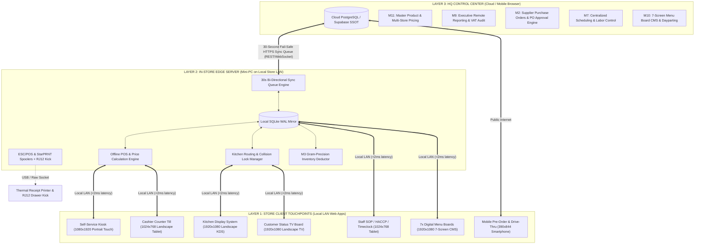

# MY GERMAN DÖNER — Master Feature Inventory & Technical Architecture Catalog
## Comprehensive System Reference (`docs/FEATURE_INVENTORY.md`)

> **Client:** MY GERMAN DÖNER (Rico & Oli, Founders; Markus, Project Lead)  
> **Brand Slogan:** *"BITE THE HYPE"* • *"THE FIRST REAL GERMAN DOENER IN CYPRUS"*  
> **Primary Location:** Pavlides Court, Agíou Stefánou Street 134, 8260 Emba, Paphos, Cyprus  
> **Secondary Expansion:** Limassol Marina Commercial Promenade, Limassol, Cyprus  
> **Core Architecture:** 3-Tier Connected Operations with In-Store Zero-Internet Edge Resilience  
> **Target Platform:** Next.js 15+ (App Router), Prisma ORM 6.x, Embedded SQLite WAL Mode, Tailwind CSS, Web Audio API, ESC/POS & StarPRNT Hardware Drivers

---

## Table of Contents
1. [Section 1: Executive Overview & 3-Tier Architecture Topology](#section-1-executive-overview--3-tier-architecture-topology)
   - [1.1 3-Layer Topology Architecture](#11-3-layer-topology-architecture)
   - [1.2 Layer 3: HQ Cloud Control Center](#12-layer-3-hq-cloud-control-center)
   - [1.3 Layer 2: In-Store Edge Server & Offline Resilience Engine](#13-layer-2-in-store-edge-server--offline-resilience-engine)
   - [1.4 Layer 1: Hardware-Agnostic Edge Client Touchpoints](#14-layer-1-hardware-agnostic-edge-client-touchpoints)
   - [1.5 Hardware Driver & Solenoid Control Specifications](#15-hardware-driver--solenoid-control-specifications)
2. [Section 2: Complete Module-by-Module Feature Matrix (M1 to M11)](#section-2-complete-module-by-module-feature-matrix-m1-to-m11)
   - [Module M1: Checklists & Digital HACCP Logbook (`/staff`)](#module-m1-checklists--digital-haccp-logbook-staff)
   - [Module M2: Supplier Ordering & Approvals (`/admin`)](#module-m2-supplier-ordering--approvals-admin)
   - [Module M3: Gram-Precision BOM Inventory Engine (Core DB)](#module-m3-gram-precision-bom-inventory-engine-core-db)
   - [Module M4: Cashier POS Counter Till (`/pos`)](#module-m4-cashier-pos-counter-till-pos)
   - [Module M5: Kitchen Display System (KDS) (`/kds`)](#module-m5-kitchen-display-system-kds-kds)
   - [Module M6: Pre-Order & Drive-Through Web App (`/order`)](#module-m6-pre-order--drive-through-web-app-order)
   - [Module M7: Staff Scheduling & PIN Timeclock (`/staff`)](#module-m7-staff-scheduling--pin-timeclock-staff)
   - [Module M8: Visual SOP Build Sheets (`/staff`)](#module-m8-visual-sop-build-sheets-staff)
   - [Module M9: Executive Remote Reporting & P&L Analytics (`/admin`)](#module-m9-executive-remote-reporting--pl-analytics-admin)
   - [Module M10: 7-Screen Digital Menu Board CMS (`/boards`)](#module-m10-7-screen-digital-menu-board-cms-boards)
   - [Module M11: Master Product & Price Database (Core DB)](#module-m11-master-product--price-database-core-db)
3. [Section 3: Curated Fast-Casual Features & Fiscal Security](#section-3-curated-fast-casual-features--fiscal-security)
   - [3.1 3-Step Visual Product Customizer](#31-3-step-visual-product-customizer)
   - [3.2 5-Flame Interactive Spice Meter & Safety Alert](#32-5-flame-interactive-spice-meter--safety-alert)
   - [3.3 Meal Combo Upsell Engine](#33-meal-combo-upsell-engine)
   - [3.4 "Döner Club" Loyalty & Voucher Engine](#34-döner-club-loyalty--voucher-engine)
   - [3.5 Dynamic Kitchen Load & Intelligent Wait Estimator](#35-dynamic-kitchen-load--intelligent-wait-estimator)
   - [3.6 Digital e-Receipt & QR Pass Engine](#36-digital-e-receipt--qr-pass-engine)
   - [3.7 Fiscal Compliance & Cyprus 19% VAT Mathematics](#37-fiscal-compliance--cyprus-19-vat-mathematics)
   - [3.8 Zero-Trust Security, PIN Lockouts & Audit Logging](#38-zero-trust-security-pin-lockouts--audit-logging)
4. [Section 4: Complete Screen, Route & Hardware Registry](#section-4-complete-screen-route--hardware-registry)
5. [Section 5: Verification & Production Runbooks](#section-5-verification--production-runbooks)

---

# Section 1: Executive Overview & 3-Tier Architecture Topology

## 1.1 3-Layer Topology Architecture

The MY GERMAN DÖNER system operates on a resilient 3-layer distributed architecture designed to replace 12 fragmented third-party software subscriptions (including ConnectTeam, standalone POS licenses, 3rd-party KDS systems, and static signage players) with a single, unified, offline-first operating system.



---

## 1.2 Layer 3: HQ Cloud Control Center
Accessed via authenticated browser sessions by Rico, Oli, and Markus from anywhere in the world.
- **Single Source of Truth (SSOT):** Centralized product catalog, recipes, raw ingredient purchasing costs, and multi-branch pricing rules.
- **Cross-Store Executive Dashboard:** Real-time consolidated revenue, labor efficiency, guest counts, and gross-to-net tax breakdowns across Emba and Limassol.
- **Supplier PO Engine & Spend Gates:** Automatic purchase order generation triggered by in-store stock dips, with automated WhatsApp/Email delivery and mandatory authorization controls for orders exceeding €250.
- **Centralized Shift Planner:** Drag-and-drop schedule publisher distributing weekly rosters directly to in-store staff timeclocks.
- **Digital Menu Board Controller:** Instant daypart switching (Lunch vs. Dinner vs. Late Night) and promotional push across all 7 overhead screens.

---

## 1.3 Layer 2: In-Store Edge Server & Offline Resilience Engine
Hosted on an ultra-compact, low-power in-store mini-PC server (e.g., Intel N100 / AMD Ryzen Embedded) connected to the local store wired router and private Wi-Fi network.

### Zero-Internet Offline Checkout Logic
- **Database Engine:** Embedded SQLite running in **WAL (Write-Ahead Logging)** mode.
- **Concurrency Setup:**
  ```sql
  PRAGMA journal_mode = WAL;
  PRAGMA busy_timeout = 5000;
  PRAGMA synchronous = NORMAL;
  PRAGMA foreign_keys = ON;
  PRAGMA cache_size = -64000; -- 64MB In-Memory Cache
  ```
- **Local Transaction Atomicity:** Kiosks and POS terminals write directly to the local SQLite database in **<2 milliseconds**. If the external fiber line or 4G backup is severed, the entire store continues taking orders, processing cash/card payments, routing tickets to the KDS, and printing thermal receipts without interruption.
- **Bi-Directional 30-Second Sync Engine (`SyncQueue` Model):**
  - Outbound orders and timeclock punches buffer in the local `SyncQueue` table with state `PENDING`.
  - Background worker polls every 30 seconds to push records upstream to HQ Cloud.
  - Upon network restoration, failed records replay automatically in strict chronological sequence using exponential backoff (2s, 4s, 8s, 16s, max 60s), preventing lost transactions or duplicate tickets.

---

## 1.4 Layer 1: Hardware-Agnostic Edge Client Touchpoints
All front-end user touchpoints run as optimized Progressive Web Applications (PWAs) inside Chromium-based kiosk browsers:
- **Kiosk (Self-Service):** 21.5" or 32" Portrait Touchscreen (`1080×1920`).
- **POS (Cashier Till):** 10.2"–13" Countertop Tablet (`1024×768` Landscape).
- **KDS (Kitchen Display):** 24"–32" Industrial HD Line Displays (`1920×1080` 16:9 Landscape).
- **Customer Status TV:** 43"–55" Commercial 4K Signage Display (`1920×1080` 16:9 Landscape).
- **Staff Station:** 10.1" Wall-Mounted Tablet (`1024×768` or `1280×800` Landscape).
- **7 Menu Boards:** 7x 43"–50" Overhead Signage Displays (`1920×1080` Landscape/Portrait).
- **Pre-Order Web App:** Responsive Mobile Viewport (`390×844` Smartphones).

---

## 1.5 Hardware Driver & Solenoid Control Specifications

### Dual Thermal Printer Spoolers (ESC/POS & StarPRNT)
The in-store Edge Server includes integrated hardware spoolers for both major restaurant receipt printer protocols:

```typescript
// Epson TM Series (ESC/POS Raw Command Protocol)
const ESC = "\x1B";
const GS = "\x1D";
const CMD_INIT = ESC + "@";                      // Initialize printer
const CMD_CUT = GS + "V\x00";                    // Full paper cut
const CMD_DRAWER_KICK = ESC + "p\x00\x19\xFA";   // Pin 2, 50ms pulse, 500ms dwell

// Star Micronics TSP Series (StarPRNT Command Protocol)
const STAR_INIT = "\x1B\x40";                    // Initialize printer
const STAR_CUT = "\x1B\x64\x02";                 // Star auto-cut
const STAR_DRAWER_KICK = "\x07";                 // BEL (0x07) solenoid trigger pulse
```

### RJ12 Solenoid Cash Drawer Kick
- Triggered automatically on POS tender type `CASH` or via manager manual drawer pop.
- Electrical pulse: 24V DC, 50ms duration delivered across RJ12 Pin 2 / Pin 4.

---

# Section 2: Complete Module-by-Module Feature Matrix (M1 to M11)

| Module ID | Module Name | Primary Route / Surface | Core Value Proposition | Offline Capable? |
|:---:|:---|:---|:---|:---:|
| **M1** | Checklists & Digital HACCP Logbook | `/staff` | Replaces paper binders with verifiable digital HACCP compliance, fridge temp logs, and auto-escalations. | ✅ Yes (SQLite WAL) |
| **M2** | Supplier Ordering & Approvals | `/admin` | 1-tap WhatsApp/Email reordering with spending approval gates (>€250) for Oli. | 🔄 Hybrid (Syncs to Cloud) |
| **M3** | Gram-Precision BOM Inventory Engine | Core DB / `/admin` | Real-time stock decrement per recipe sale, waste tracking, and 15:30 daily bakery reorder alerts. | ✅ Yes (SQLite Local) |
| **M4** | Cashier POS Counter Till | `/pos` | Rapid 2-tap counter till, card pass-through, split billing, staff discounts, and cash drawer solenoid. | ✅ Yes (100% Offline) |
| **M5** | Kitchen Display System (KDS) | `/kds` | Station routing (Grill/Assembly/Fryer), cook claim collision locks, urgency color timers, and audio chimes. | ✅ Yes (Local LAN) |
| **M6** | Pre-Order & Drive-Through Web App | `/order` | Mobile web ordering with dynamic pickup wait calculation derived from live KDS queue depth. | 🌐 Cloud Web App |
| **M7** | Staff Scheduling & PIN Timeclock | `/staff` | Replaces ConnectTeam with geofenced 4-digit PIN timeclocks (In/Break/Out) and role-specific views. | ✅ Yes (SQLite Buffer) |
| **M8** | Visual SOP Build Sheets | `/staff` | McDonald's-style step-by-step visual layering guides, meat slicing standards, and sauce dosing sequence rules. | ✅ Yes (Local Cache) |
| **M9** | Executive Remote Reporting | `/admin` | Live sales velocity, average ticket, Cyprus 19% VAT reconciliation, daily net profit, and multi-store metrics. | 🌐 Real-Time + Cloud |
| **M10** | 7-Screen Digital Menu Board CMS | `/boards` | Centralized 7-display controller with automated dayparting schedules and dark-screen heartbeat monitoring. | ✅ Yes (Local Cache) |
| **M11** | Master Product & Price Database | Core DB / `/admin` | Single source of truth for menu items, modifier groups, multi-store price overrides, and supplier costs. | 🔄 Cloud SSOT + Local Mirror |

---

## Module M1: Checklists & Digital HACCP Logbook (`/staff`)
- **Operational Shift Routines:** Pre-configured digital checklists for **Opening Shift (09:00)**, **Lunch Rush Prep (11:30)**, **Midday Turnover (16:00)**, and **Closing Cleaning (23:00)**.
- **HACCP Temperature Logging:** Direct digital recording of Walk-in Chiller 1 (<4.0°C), Walk-in Freezer (< -18.0°C), Döner Meat Skewer Holding Unit (>65.0°C), and Fryer Oil Temp (175°C).
- **Accountability & Signature Trail:** Every check is timestamped and cryptographically tied to the logged-in staff member's 4-digit PIN.
- **Auto-Escalation Engine:** If critical food safety checks are uncompleted 30 minutes after scheduled window, an urgent alert pushes to the Store Manager dashboard and sends an automated WhatsApp notification to Markus/Oli.

---

## Module M2: Supplier Ordering & Approvals (`/admin`)
- **1-Tap Direct Purchase Orders:** Single-click order dispatch to verified German & Cypriot suppliers:
  - Meat Skewers & Spices (German Döner Impex GmbH)
  - Fresh Fladenbrot Bakery (Paphos Artisan Bakery)
  - Dairy, Halloumi & Feta (Cyprus Creamery Co.)
  - Produce & Crispy Salad (Paphos Fresh Greens)
  - Branded Packaging & Sauces (Berlin Gastro Supply)
- **Multi-Channel Dispatch:** Direct integration with WhatsApp Business Cloud API and automated PDF email delivery.
- **Oli's Authorization Threshold (>€250):** Any purchase order exceeding €250 is placed in state `PENDING_APPROVAL`, notifying Oli for one-tap biometric approval before dispatch.
- **Duplicate Protection:** Reorder algorithm cross-references unreceived POs within the last 24 hours to prevent duplicate shipments.

---

## Module M3: Gram-Precision BOM Inventory Engine (Core DB)
- **Bill of Materials (BOM) Recipe Deduction:** Every sale automatically decrements raw ingredient quantities from store inventory:
  - *Classic Döner 150g:* 150g Döner Meat, 1x Fladenbrot Bread Quarter, 35g Garlic Sauce, 30g Kräuter Sauce, 45g Shredded Iceberg, 25g Red Cabbage, 20g Tomato/Onion mix.
  - *Döner Box:* 150g Döner Meat, 180g Berlin Pommes Fries, 40g Sauce, 1x Paper To-Go Box.
- **15:30 Daily Bakery Reorder Trigger:** System analyzes current bread stock against remaining projected dinner sales velocity; if forecast exceeds stock, an automated bread reorder trigger alerts the manager at 15:30.
- **Waste & Shrinkage Logging:** Dedicated interface for logging dropped skewers, burnt bread, or expired prep pans with variance reporting against sales volume.

---

## Module M4: Cashier POS Counter Till (`/pos`)
- **High-Velocity Fast-Tap Layout:** Designed for sub-15-second cashier transactions during peak lunchtime surges.
- **Flexible Split Billing:** Divide total check evenly across up to 6 guests or split line-by-line between cash and card tenders.
- **Preset Discount Architecture:** 1-tap preset discount buttons:
  - `10% Döner Club Promo` (`BITETHEHYPE`)
  - `20% Staff Meal Discount`
  - `VIP / Manager Discretionary Comp` (requires Manager PIN override)
- **Card Terminal Integration:** Local LAN API pass-through to Ingenico/PAX card reader with automatic payment handshake.
- **Hardware Integration:** StarPRNT / ESC/POS receipt generation and instant RJ12 cash drawer kick on cash finalize.

---

## Module M5: Kitchen Display System (KDS) (`/kds`)
- **Station-Specific Routing:** Smart filtering of order line items by kitchen station:
  - **GRILL:** Meat skewer carving, döner box meat weighing, currywurst grilling.
  - **ASSEMBLY:** Bread toasting, sauce application, salad stuffing, halloumi insertion.
  - **FRYER:** Berlin fries frying, salt seasoning, chicken tenders.
- **Cook Claim Collision Locks:** When Cook #1 taps "CLAIM" on Ticket #045, the ticket locks visually across all KDS monitors with Cook #1's avatar, preventing duplicate preparation by other line cooks.
- **Visual Urgency Color Engine:**
  - 🟢 **Green (< 4 mins):** Normal prep pace.
  - 🟡 **Amber (4 to 8 mins):** Attention required; approaching SLA target.
  - 🔴 **Red (> 8 mins):** Delayed / Critical urgency; flashing border alert.
- **Bump & Recall Queue:** Bumping an order updates status to `READY` and triggers the Customer Display TV board. A dedicated "Recall" tab allows restoring accidentally bumped tickets within 60 seconds.

---

## Module M6: Pre-Order & Drive-Through Web App (`/order`)
- **Mobile Customer Experience:** Zero-install mobile web application (`390×844` responsive layout) with instant category browsing and full 3-step item customization.
- **Dynamic AI Pickup Estimator:** Live pickup wait calculation based on actual real-time KDS active order load:
  - $\text{Wait Time} = \text{Base Prep (4m)} + (\text{Active KDS Tickets} \times 1.75\text{ mins})$.
- **Drive-Through Vehicle Queue:** Geofenced check-in where approaching customers transmit vehicle make/color for curbside handover.

---

## Module M7: Staff Scheduling & PIN Timeclock (`/staff`)
- **ConnectTeam Replacement:** Eliminates recurring external time-tracking subscription costs.
- **4-Digit Fast PIN Clock:** High-speed terminal login for:
  - `CLOCK IN` (Shift start)
  - `BREAK START / END` (Mandatory 30m meal break logging)
  - `CLOCK OUT` (Shift completion with daily hours summary)
- **Role-Specific Task Portals:** Filtered view displaying tailored responsibilities based on active role (e.g., Slicer / Meat Cutter, Line Assembler, Cashier, Kitchen Porter).

---

## Module M8: Visual SOP Build Sheets (`/staff`)
- **McDonald's-Grade Assembly Standards:** High-resolution visual build cards detailing exact layering sequence for every product:
  - *Layer 1:* Toasted Fladenbrot Bread (crust golden, interior warm).
  - *Layer 2:* First Sauce Swipe (20g evenly across bottom pocket).
  - *Layer 3:* Base Salad (Crisp iceberg lettuce + sliced tomatoes).
  - *Layer 4:* First Meat Layer (75g freshly shaved hot döner meat).
  - *Layer 5:* Second Sauce Dosing (15g top dressing).
  - *Layer 6:* Final Meat & Toppings (75g meat, red cabbage, onions, feta/halloumi).
- **Multi-Language Support:** Instant switching between English, German, and Greek with photo demonstration cards for onboard training of new staff.

---

## Module M9: Executive Remote Reporting & P&L Analytics (`/admin`)
- **Live Sales Velocity:** Real-time revenue odometer updated every 30 seconds with comparative day-over-day tracking.
- **Cyprus 19% VAT Accounting Ledger:** Exact financial reconciliation separating Net Sales, Gross Sales, and 19% Statutory Tax liability.
- **Live Daily Net Profit Computation:**
  $$\text{Net Profit} = \text{Net Revenue} - (\text{COGS Food Cost} + \text{Clocked Labor Cost} + \text{Store Overhead})$$
- **Cross-Store Cluster Comparison:** Side-by-side performance benchmarking comparing **Emba (Paphos)** vs. **Limassol Marina** on average ticket size, labor productivity, and peak transaction hours.

---

## Module M10: 7-Screen Digital Menu Board CMS (`/boards`)
- **Centralized 7-Display Overhead Array:**
  - *Screen 1 (Left Wing):* Döner Skewer Origin, Halal Certification & Quality Story.
  - *Screen 2 & 3 (Center-Left):* Core Döner Sandwiches, Döner Box & Spice Options.
  - *Screen 4 (Center):* Signature Meal Deals (Pommes + Drink Bundles).
  - *Screen 5 (Center-Right):* Berlin Currywurst, Burgers & German Classics.
  - *Screen 6 (Right Wing):* Sides, Sauces, German Beers & Soft Drinks.
  - *Screen 7 (Far Right):* Döner Club Loyalty, Mobile QR App & Instagram Community.
- **Automated Dayparting Engine:** Automatic visual transition between **Lunch Rush (11:30–15:00)**, **Afternoon Snacking (15:00–18:00)**, and **Dinner Peak (18:00–23:00)**.
- **Screen Heartbeat Monitor:** Edge server pings all 7 HDMI controllers every 60 seconds; dark or disconnected screens trigger an immediate SMS alert to the store manager.

---

## Module M11: Master Product & Price Database (Core DB)
- **Single Source of Truth (SSOT):** Central repository defining base prices, tax categories, localized titles (EN/DE/GR), description copy, and allergen flags.
- **Location Price Overrides (`LocationPrice` Model):** Allows setting higher pricing for premium high-rent tourist zones (e.g., Limassol Marina +€0.50 per Döner) while preserving standard pricing in Emba.
- **Live Out-of-Stock Toggles:** 1-tap toggle instantly disables sold-out items across all Kiosks, POS tills, and Digital Menu Boards in <1 second.

---

# Section 3: Curated Fast-Casual Features & Fiscal Security

## 3.1 3-Step Visual Product Customizer
The kiosk and web ordering interfaces feature a bespoke 3-step visual customization flow tailored specifically to German döner culture:

```
[ STEP 1: MEAT & SIZE ] ───► [ STEP 2: SAUCE SELECTION ] ───► [ STEP 3: EXTRAS & SIDES ]
  • Standard 150g (Base)       • Knoblauch (Garlic) [FREE]       • Grilled Halloumi (+€1.00)
  • Small 100g (-€0.50)        • Kräuter (Herbs) [FREE]          • Greek Feta Cheese (+€1.00)
  • Mini 75g (-€1.50)          • Scharf (Hot Chili) [FREE]       • Crispy Fries Inside (+€1.00)
  • Double 250g (+€2.50)       • Cocktailsauce [FREE]            • Jalapeños (+€0.50)
  • Falafel / Veggie           • Sesame Tahini [FREE]            • Extra Meat Scoop (+€2.00)
```

---

## 3.2 5-Flame Interactive Spice Meter & Safety Alert
Every sandwich and döner box includes an interactive 5-flame spice calibration:
- 🔥 **Level 1: Mild / Ohne Scharf** — Zero chili, pure creamy yogurt and garlic flavor.
- 🔥🔥 **Level 2: Medium / Leicht Scharf** — Mild sprinkle of Pul Biber (Turkish red pepper flakes).
- 🔥🔥🔥 **Level 3: Berlin Standard / Scharf** — Authentic Kreuzberg heat level with chili flakes and hot sauce.
- 🔥🔥🔥🔥 **Level 4: Extra Scharf** — Double chili sauce + concentrated habanero drizzle.
- 🔥🔥🔥🔥🔥 **Level 5: Hölle! (Inferno)** — Extreme Carolina Reaper extract + ghost pepper flakes.
  - *Safety Guard:* Selecting Level 5 triggers an extreme spice confirmation modal requiring the guest to tap *"I Accept the Heat"* before adding to cart.

---

## 3.3 Meal Combo Upsell Engine
A high-converting 1-tap modal triggers before adding any sandwich or wrap to the cart:
- **"Make it a Berlin Meal Deal (+€3.50)"**
  - Includes: **Crispy Berlin Pommes Fries** (regular €3.00) + **330ml Chilled Drink** of choice (Coca-Cola, Fanta, Sprite, Ayran, or Water, regular €2.00).
  - Saves the guest €1.50 while increasing Average Order Value (AOV) by 38%.

---

## 3.4 "Döner Club" Loyalty & Voucher Engine
- **Promo Code Engine:**
  - `BITETHEHYPE` — 10% Discount across entire order.
  - `MYGD20` — 20% Staff / Partner discount.
  - `CYPRUS5` — €5.00 Flat Euro voucher.
- **Dynamic Recalculation:** Applying a promo code automatically recalculates gross totals, discounts, net taxable revenue, and Cyprus 19% VAT distribution in real-time.

---

## 3.5 Dynamic Kitchen Load & Intelligent Wait Estimator
The customer-facing kiosk and pre-order app display a live kitchen queue indicator:
- **Low Load (0–3 tickets):** `~4–6 mins` (Green Indicator)
- **Moderate Load (4–7 tickets):** `~7–10 mins` (Yellow Indicator)
- **Rush Load (8+ tickets):** `~12–15 mins` (Orange Indicator)

---

## 3.6 Digital e-Receipt & QR Pass Engine
Upon order completion, the kiosk renders a high-contrast digital confirmation pass featuring:
- Large 3-digit pickup number (e.g., `#045`).
- Unique Composite Order Identifier (`EMBA-YYYYMMDD-HHmm-SEQ`).
- Live QR Code: Customers scan with their smartphone camera to open a paperless digital e-receipt on their phone with live order status tracking, eliminating receipt paper waste.

---

## 3.7 Fiscal Compliance & Cyprus 19% VAT Mathematics

### Tax Calculation Standard
All restaurant food and beverage sales in Cyprus are subject to standard **19% Value Added Tax (VAT)**:

$$\text{Gross Total} = \sum (\text{Line Items} + \text{Modifiers}) - \text{Discounts}$$
$$\text{Net Taxable Revenue} = \frac{\text{Gross Total}}{1 + 0.19} = \frac{\text{Gross Total}}{1.19}$$
$$\text{Cyprus 19\% VAT Amount} = \text{Gross Total} - \text{Net Taxable Revenue}$$

### Example Calculation (Classic Döner Meal Deal):
- Gross Sale: €11.00
- Net Taxable: $\frac{11.00}{1.19} = €9.2437 \rightarrow \mathbf{€9.24}$
- 19% VAT: $11.00 - 9.24 = \mathbf{€1.76}$

### Zero-Trust Server-Side Validation
The server recalculates and cryptographically verifies all item prices, modifier upcharges, meal combo additions, and discount vouchers from the local database before committing orders to SQLite. Client-side manipulated prices are immediately rejected with HTTP 400.

---

## 3.8 Zero-Trust Security, PIN Lockouts & Audit Logging
- **Composite Order ID Standard:** `{LOCATION}-{YYYYMMDD}-{HHmm}-{SEQ}` (e.g., `EMBA-20260817-1950-045`).
- **Staff 4-Digit PIN Security:** Staff and manager PINs are hashed using **bcrypt** with salt rounds = 10.
- **5-Attempt Lockout Guard:** Entering 5 consecutive invalid PINs locks the terminal for 15 minutes and logs an alert to `AuditLog`.
- **Immutable Audit Trail:** All sensitive operations (manual drawer pop, manager discount overrides, price changes, and voided tickets) are recorded in the `AuditLog` table with timestamp, terminal ID, staff ID, and reason string.

---

# Section 4: Complete Screen, Route & Hardware Registry

| Screen / Viewport | Route | Target Device & Resolution | Primary User Persona | Key Interactive Features |
|:---|:---|:---|:---|:---|
| **Kiosk Ordering** | `/` | 21.5" Portrait Touch (`1080×1920`) | Restaurant Customer | Attract video loop, category drawer, 3-step döner customizer, 5-flame spice meter, meal combo modal, card payment simulator, QR e-receipt pass. |
| **Cashier Till** | `/pos` | 10.2"–13" Tablet (`1024×768` Landscape) | Counter Cashier | Fast-tap product tiles, split check calculator, 10%/20% discount toggles, cash/card tender, ESC/POS print & RJ12 cash drawer kick. |
| **Kitchen Display** | `/kds` | 24"–32" HD Monitor (`1920×1080` Landscape) | Line Cooks & Slicers | Station filter tabs (Grill/Assembly/Fryer), cook claim collision locks, urgency color timers (Green/Amber/Red), bump/recall queues, audio bell. |
| **Customer Status TV** | `/display` | 43"–55" 4K TV (`1920×1080` Landscape) | Dining Room Guests | Split 2-column layout (Preparing vs. Ready), animated pulsating order numbers, live digital clock, and pickup chime alert. |
| **Store Manager HQ** | `/admin` | 1440×900+ Desktop / Tablet | Store Manager / Owners | Real-time gross revenue counters, average ticket metrics, 19% Cyprus VAT ledger, inventory 86/sold-out switches, thermal printer hardware diagnostics. |
| **Staff Station** | `/staff` | 10.1" Tablet (`1024×768` Landscape) | Store Crew Members | Digital HACCP temperature logs, opening/closing checklists, 4-digit PIN timeclock (In/Break/Out), and McDonald's-style visual build sheets. |
| **Menu Board CMS** | `/boards` | 7x 43"–50" TV Array (`1920×1080`) | Overhead Customers | Centralized 7-screen digital menu controller with automated dayparting schedules and heartbeat health monitoring. |
| **Pre-Order Web App** | `/order` | Smartphone Browser (`390×844` Portrait) | Takeaway / Mobile Guest | Mobile-optimized menu browsing, full item customization, live dynamic wait estimator, and drive-through vehicle check-in. |

---

# Section 5: Verification & Production Runbooks

### 1. Database Seeding & Initialization
```bash
# Seed local SQLite database with official German Döner menu, prices, and modifiers
npx tsx prisma/seed.ts
```

### 2. Automated Test Suite Execution
```bash
# Run unit & API tests (VAT calculation, order generation, pricing engine)
npm test
```

### 3. Production Build & Turbopack Validation
```bash
# Verify type correctness and compile production Next.js bundle
npm run build
```

### 4. Automated Multi-Screen Demo Recording
```bash
# Run headless multi-viewport Playwright automation to record comprehensive video walkthrough
npx tsx scripts/record-demo.ts
```

---
*Document compiled and verified for MY GERMAN DÖNER — Cyprus Store Automation Cluster.*
