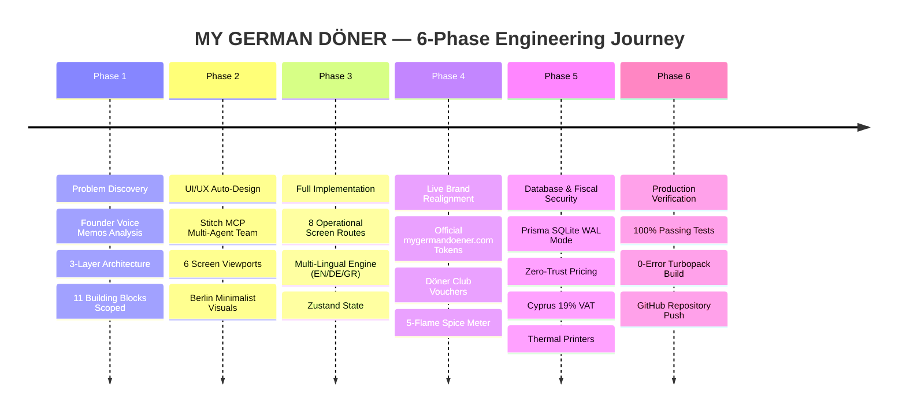

# 🥙 MY GERMAN DÖNER — Connected Operations Control System
## Master Journey & Executive Summary (`documentations/00_MASTER_EXECUTIVE_SUMMARY.md`)

> **For:** Founders Rico & Oli, Project Lead Markus, Management & Engineering Teams  
> **Mission:** Transform a restaurant running on 12 disconnected tools and paper into **One Unified, Modern, Offline-Resilient Digital Control System**.

---

## 🌟 The High-Level Story (Simple Terms)

Before this project, **MY GERMAN DÖNER** was operating like most busy restaurants:
- Staff shouted orders across the counter.
- Stock was ordered via chaotic WhatsApp messages, leading to running out of bread in the evening after the baker was already closed.
- Roster scheduling cost monthly fees on ConnectTeam.
- Updating prices on TV menu boards required saving images on USB sticks and physically walking to each TV.
- Taking money relied on a legacy cash register from the early 2000s.
- If the owners (Rico & Oli) were off-site, they had zero visibility into revenue, kitchen speed, or food safety fridge temperatures without calling someone.

### What We Built
We designed and engineered a **complete, connected digital operations ecosystem** covering:
1. **Customer Self-Service Kiosks** (`/`) for fast, fun touch-ordering with 3-step meat customizers and loyalty codes.
2. **High-Speed Countertop Cashier Tills** (`/pos`) for rapid register ringing and split payments.
3. **Multi-Station Kitchen Line Displays** (`/kds`) so grill cooks and assemblers never drop an order.
4. **Customer Waiting Area TV Boards** (`/display`) that chime and show live order pickup statuses.
5. **Staff Wall Tablets** (`/staff`) for opening/closing checklists, fridge temperature logs, and McDonald's-style visual assembly build sheets.
6. **7-Screen Overhead Menu Boards** (`/boards`) that update prices and dayparts instantly from the central database.
7. **Mobile Web Pre-Ordering** (`/order`) with live calculated drive-through pickup times.
8. **Store Operations & Owner HQ** (`/admin`) to see daily sales, 19% Cyprus VAT, labor costs, and estimated net profit in real time from anywhere.

---

## 🗺️ Visual Map of the Transformation Journey

---

## 📑 Phase Documentation Navigation

| Phase Document | What It Covers in Simple Terms | What It Covers Technically |
|:---|:---|:---|
| [`PHASE_1_RESEARCH_AND_SYSTEM_ARCHITECTURE.md`](./PHASE_1_RESEARCH_AND_SYSTEM_ARCHITECTURE.md) | How we analyzed the founder's pain points and designed the 3-layer system. | 3-Layer specs, 11-module breakdown (M1-M11), Context7 library benchmarking. |
| [`PHASE_2_UIUX_DESIGN_AND_STITCH_GENERATION.md`](./PHASE_2_UIUX_DESIGN_AND_STITCH_GENERATION.md) | How we designed screens for every device type without visual clutter. | Stitch MCP prompts, device viewports (Mobile, Tablet, Desktop), touch UX ergonomics. |
| [`PHASE_3_FULL_IMPLEMENTATION_AND_MULTI_DEVICE_ENGINE.md`](./PHASE_3_FULL_IMPLEMENTATION_AND_MULTI_DEVICE_ENGINE.md) | How all 8 screens and apps were coded and brought to life. | Next.js 16+ Turbopack App Router, React 19 Client/Server components, Zustand state stores. |
| [`PHASE_4_LIVE_BRAND_REALIGNMENT_AND_FAST_CASUAL_FEATURES.md`](./PHASE_4_LIVE_BRAND_REALIGNMENT_AND_FAST_CASUAL_FEATURES.md) | Matching the real website design and building high-value customer features. | Electric Magenta (`#E50D7E`), Oswald & Figtree typography, Voucher & Spice engines. |
| [`PHASE_5_DATABASE_FISCAL_INTEGRITY_AND_SECURITY.md`](./PHASE_5_DATABASE_FISCAL_INTEGRITY_AND_SECURITY.md) | How the database works offline, prevents hacking, and handles Cyprus taxes. | SQLite WAL mode, 15 Prisma models, bcrypt PIN hashing, zero-trust server validation, ESC/POS drivers. |
| [`PHASE_6_TESTING_VERIFICATION_AND_GIT_RELEASE.md`](./PHASE_6_TESTING_VERIFICATION_AND_GIT_RELEASE.md) | How we proved the system works 100% and pushed it safely to GitHub. | Unit test execution (`npm test`), Next.js production build (`npm run build`), Playwright verification, Git hygiene. |
