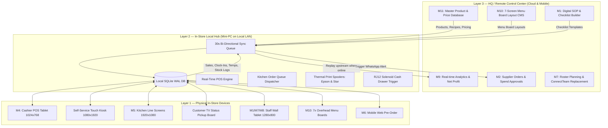

# Phase 1: Deep Research, Founder Voice Memos & System Architecture
## Documentation Guide (`documentations/PHASE_1_RESEARCH_AND_SYSTEM_ARCHITECTURE.md`)

> **Goal:** Transform the raw operational chaos described in 6 founder voice memos into an enterprise-grade, offline-first 3-layer system architecture with 11 distinct functional building blocks.

---

## 🎯 1. Simple Summary (For Everyone)

When Rico and Oli (the founders) described how their restaurant runs day-to-day, they highlighted three major headaches:
1. **Tool Overload:** They had separate tools for everything — ConnectTeam for staff schedules, WhatsApp for orders, Canva for TV screens, paper notes for opening checks, and a POS register from the year 2000.
2. **The "Blind Owner" Problem:** When Rico or Oli weren't physically in the store in Emba, they had no way of knowing how much money was made, how busy the kitchen was, or if the fridge was cold enough to keep meat fresh.
3. **The Internet Risk:** If the restaurant internet ever went down or someone forgot to pay the bill, old systems would stop working completely, leaving cashiers unable to print receipts or take orders.

### What We Did in Phase 1
We designed an architecture where:
- Everything pulls from **one single central database** (a price change is typed once and updates the kiosk, the cash register, the menu boards, and the website).
- The store has a **local computer inside the restaurant** so the cash register and kitchen screens keep running smoothly even if the internet cable is cut.
- The 11 core jobs of the restaurant were organized into 11 clear modules (M1 to M11).

---

## 🔬 2. Technical Deep Dive (For Engineers)

### The 3-Layer System Model

### The 11 Building Blocks (M1 to M11)
1. **M1 — Checklists & Logbook:** Opening, lunch, closing digital checklists with numerical HACCP fridge temperature logging and automated manager follow-ups.
2. **M2 — Supplier Ordering:** 1-tap reorder cards, duplicate order detection, and spending approval thresholds for orders over €250.
3. **M3 — Gram-Precision Inventory:** Real-time recipe deduction (150g meat, 1 bread, 35g sauce per sale), 15:30 predictive bakery alerts.
4. **M4 — POS Cashier Till:** Offline-capable till with split billing, staff discount pills, and cash drawer solenoid control.
5. **M5 — Kitchen Display (KDS):** Multi-station ticket routing (`GRILL`, `ASSEMBLY`, `FRYER`), cook claim locks, and urgency color timers.
6. **M6 — Pre-Order & Drive-Through:** Mobile web ordering with dynamic pickup wait time calculated dynamically from active KDS tickets.
7. **M7 — Scheduling & Time Tracking:** Roster planner, geofenced in-store PIN timeclock, and role-filtered task lists.
8. **M8 — McDonald's-Style Build Sheets:** Visual photo assembly guides and sauce sequence rules.
9. **M9 — Executive Reporting:** Real-time revenue, guest count, avg ticket, labor %, and Cyprus 19% VAT reconciliation.
10. **M10 — 7-Screen Menu Boards:** Centrally managed overhead displays with automated dayparting (Lunch vs Dinner).
11. **M11 — Master Database:** Single source of truth for products, prices, per-location pricing, recipes, and supplier costs.

### Context7 Tech Stack Research
Using the Context7 MCP documentation tools, we researched modern best practices for:
- **Next.js 16+ Turbopack App Router:** Hybrid Server Components and Client Components for sub-millisecond local routing.
- **Prisma 6.x ORM:** Strict type-safe queries on embedded SQLite with WAL (Write-Ahead Logging) concurrency.
- **Zustand State Stores:** Lightweight client state management for the ordering flow, active cart, and multi-language dictionary.
- **Framer Motion:** Spring-based micro-animations and bottom sheet gesture drawers.

---

## 📦 Phase 1 Deliverables
* Documented 3-layer architecture in [`gemini.md`](file:///Users/saiedsagar/DEVELOPER/DEVELOPER/MYGD/GEMINI.md).
* Initial implementation blueprint in [`task_plan.md`](file:///Users/saiedsagar/DEVELOPER/DEVELOPER/MYGD/task_plan.md).
* Research findings recorded in [`findings.md`](file:///Users/saiedsagar/DEVELOPER/DEVELOPER/MYGD/findings.md).
