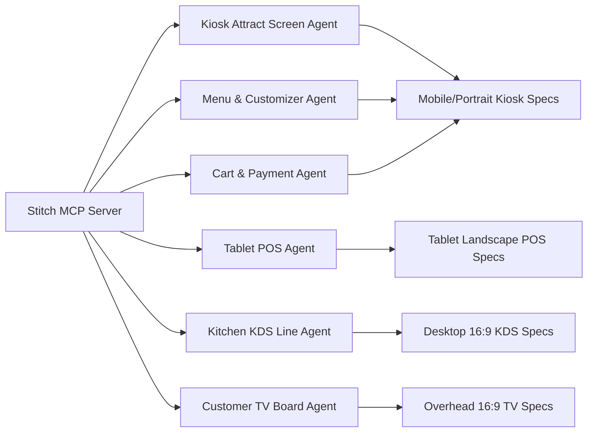
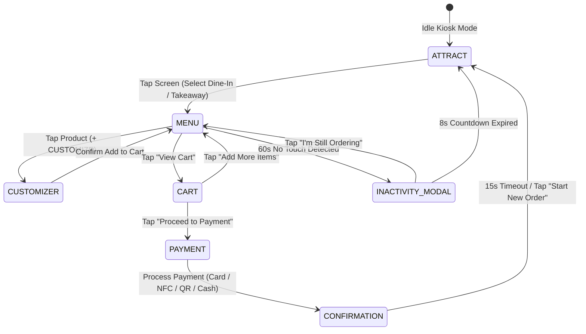

# Phase 2: UI/UX Flow & Stitch Auto-Design Generation
## Documentation Guide (`documentations/PHASE_2_UIUX_DESIGN_AND_STITCH_GENERATION.md`)

> **Goal:** Create intuitive, modern, touch-friendly user interfaces for every screen in the restaurant using the Stitch MCP visual design engine before writing frontend code.

---

## 🎯 1. Simple Summary (For Everyone)

In a restaurant, different people use different devices in very different ways:
- A **hungry customer** standing in front of a giant 32" kiosk wants big appetizing pictures of food, large buttons they can easily tap with one finger, and clear choices (e.g. *"Chicken or Beef?"*, *"Mild or Spicy?"*).
- A **cashier** on a 10" tablet till needs high-speed buttons with small taps to ring up customers in 5 seconds.
- A **cook in the kitchen** needs giant high-contrast text they can read from 2 meters away while grilling meat.
- A **waiting guest** looking at an overhead TV needs to easily spot their order number with a clean chime sound.

### What We Did in Phase 2
We spawned a team of specialized AI design subagents using **Stitch MCP** to generate visual mockups and layout specifications for every device type. We avoided cluttered clichés (no confusing dashboard widgets, no tiny unreadable text) and focused on high-contrast, modern Berlin street-food aesthetics.

---

## 🔬 2. Technical Deep Dive (For Engineers)

### Multi-Agent Stitch Generation Pipeline
We initialized Project ID `8267423676963551603` in Stitch and dispatched dedicated agents for each screen persona:

### Screen Flow & State Machine for Self-Service Kiosk (`/`)

### Device Viewport Matrix

| Screen Role | Target Device | Resolution | Aspect Ratio | Ergonomic Touch Targets |
|:---|:---|:---:|:---:|:---|
| **Kiosk Ordering** | 21.5"–32" Commercial Touchscreen | `1080×1920` | `9:16` Portrait | Min 54×54px touch targets; bottom-half action zones for wheelchair ADA compliance. |
| **Cashier Till** | 10.2"–13" iPad or Galaxy Tab | `1024×768` | `4:3` Landscape | 44×44px rapid grid buttons; sticky right-hand ticket summary for thumb operation. |
| **Kitchen KDS** | 24"–32" Industrial HD Monitor | `1920×1080` | `16:9` Landscape | 100% visible from 2–3 meters; color-coded urgency tickets; giant BUMP buttons. |
| **Pickup TV** | 43"–55" Commercial 4K TV | `1920×1080` | `16:9` Landscape | 72pt+ monospace numbers; split 50/50 *Preparing* vs *Ready* columns. |
| **Staff Tablet** | 10.1" Wall-Mounted Tablet | `1280×800` | `16:10` Landscape | Numerical keypad with 48px buttons for rapid 4-digit PIN entry. |
| **Menu Boards** | 7x 43"–50" Overhead TV Displays | `1920×1080` | `16:9` Landscape | High contrast, zero decorative fluff, high appetite appeal food photography. |

---

## 📦 Phase 2 Deliverables
* Screen design portfolio documented in [`all_device_screens_showcase.md`](file:///Users/saiedsagar/.gemini/antigravity/brain/3961d47f-8c5e-45da-b880-47f05bde0695/all_device_screens_showcase.md).
* Individual screen HTML mockups saved:
  - `customer_facing_tablet_screen.html`
  - `customer_order_tv_board.html`
  - `kds_screen.html`
  - `order_confirmation_screen.html`
  - `payment_method_screen.html`
  - `store_manager_admin_screen.html`
