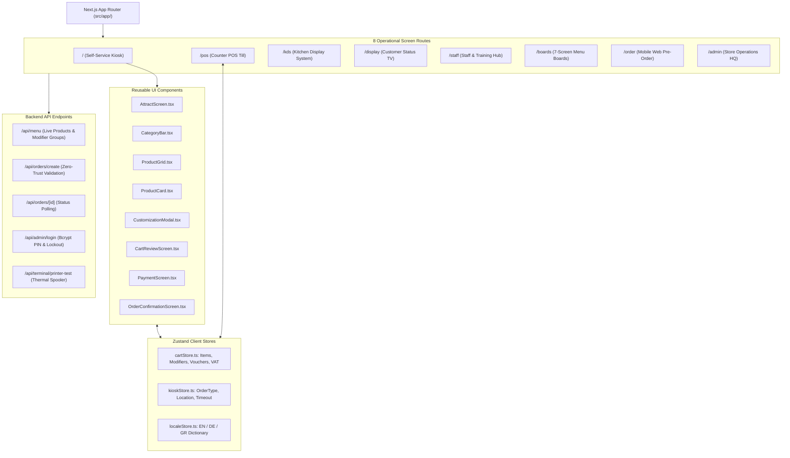
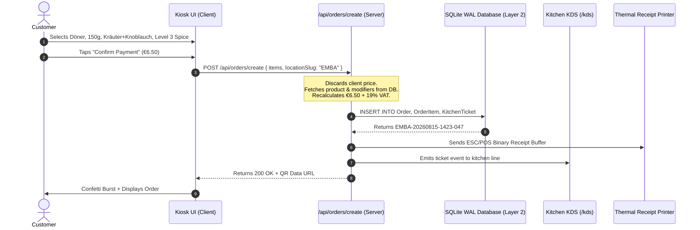

# Phase 3: Full Implementation & Multi-Device Engine
## Documentation Guide (`documentations/PHASE_3_FULL_IMPLEMENTATION_AND_MULTI_DEVICE_ENGINE.md`)

> **Goal:** Convert the visual designs and architectural blueprints into working, production-grade Next.js 16+ code across all 8 dedicated screen routes.

---

## 🎯 1. Simple Summary (For Everyone)

In Phase 3, we turned all the design mockups into **real, working applications** that you can open on any browser, tablet, phone, or kiosk screen:
- When a customer orders on the kiosk, the item instantly appears on the kitchen line screen for the cooks.
- When the cooks press **"Bump Ticket"** to say the food is ready, the waiting area TV instantly chimes and shows the order number in the green "Ready for Pickup" column.
- If a German or Greek tourist visits the kiosk, they tap the flag icon, and the entire menu instantly translates into German (`DE`) or Greek (`EL`).
- When a cashier rings up cash on the till, the system calculates the exact change and sends a signal to pop open the physical cash drawer.

---

## 🔬 2. Technical Deep Dive (For Engineers)

### Component Hierarchy & Route Layout

### Multi-Lingual Internationalization (i18n) Engine
Built without heavy third-party bundle bloat using lightweight JSON dictionary mapping:
- [`src/locales/en.json`](file:///Users/saiedsagar/DEVELOPER/DEVELOPER/MYGD/src/locales/en.json) (English)
- [`src/locales/de.json`](file:///Users/saiedsagar/DEVELOPER/DEVELOPER/MYGD/src/locales/de.json) (German)
- [`src/locales/gr.json`](file:///Users/saiedsagar/DEVELOPER/DEVELOPER/MYGD/src/locales/gr.json) (Greek)
- Instant locale switching in [`src/store/localeStore.ts`](file:///Users/saiedsagar/DEVELOPER/DEVELOPER/MYGD/src/store/localeStore.ts) with zero page reload.

### Order Creation & Processing Flow

---

## 📦 Phase 3 Deliverables
* Fully functional Next.js application codebase in `src/`.
* 8 dedicated screen routes compiled and operational:
  - `/` (Kiosk)
  - `/pos` (Till)
  - `/kds` (Kitchen)
  - `/display` (TV Board)
  - `/staff` (Staff Hub)
  - `/boards` (Menu Boards)
  - `/order` (Mobile Web)
  - `/admin` (Store Backoffice)
