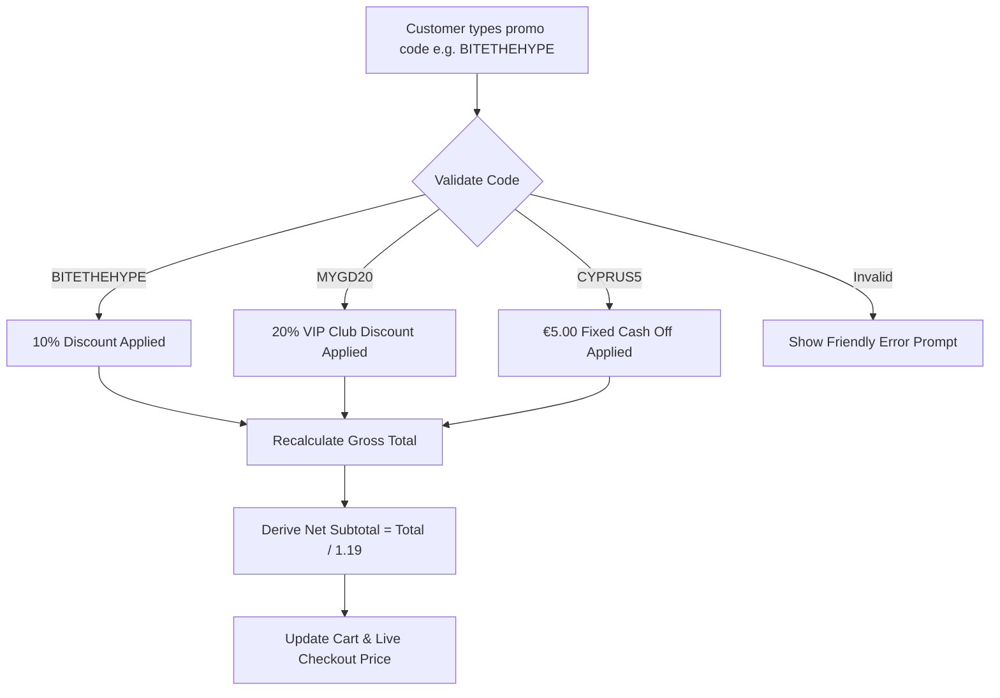

# Phase 4: Live Brand Realignment & Fast-Casual Features
## Documentation Guide (`documentations/PHASE_4_LIVE_BRAND_REALIGNMENT_AND_FAST_CASUAL_FEATURES.md`)

> **Goal:** Align every visual asset and design token with the client's official live website ([mygermandoener.com](https://mygermandoener.com/)) and build curated features designed specifically for high-volume döner kebab operations.

---

## 🎯 1. Simple Summary (For Everyone)

When we checked the client's live website, we noticed the official brand had a distinctive **Berlin street-style electric neon aesthetic**:
- Sleek dark charcoal graphite backgrounds.
- Electric Neon Magenta (hot pink) action buttons and price callouts.
- Electric Cyan badges and highlights.
- Bold, energetic headlines with the slogan **"BITE THE HYPE"** and **"THE FIRST REAL GERMAN DOENER IN CYPRUS"**.

### Features We Added for the Döner Concept
We built features that modern fast-casual restaurants (like Shake Shack, German Doner Kebab UK, and McDonald's) use to boost average order value and delight guests:
1. **Döner Club Promo Vouchers:** Customers can type promo codes like `BITETHEHYPE` to get 10% off.
2. **3-Step Customizer:** Choose meat portion (`Standard 150g`, `Small 100g`, `Mini 75g`), bread, homemade sauces (up to 3 free), and €1 extras (Grilled Halloumi, Greek Feta, Fries Inside).
3. **5-Flame Spice Meter:** Visual flame scale from Mild to Level 5 "Hölle" (Fiery Hell) with warning prompt.
4. **1-Tap Meal Combo Deal:** Upgrade any sandwich with crispy Berlin paprika fries and a cold drink for just +€3.50.
5. **Smart Dietary Filters:** Filter the whole menu with 1 tap to see `🌱 Veggie`, `🔥 Spicy`, or `⭐ Top Sellers`.
6. **Smart Dynamic Wait Timer:** Shows customers an honest, accurate wait time (e.g. `~6-8 mins`) based on how busy the kitchen currently is.

---

## 🔬 2. Technical Deep Dive (For Engineers)

### Official Design Tokens Matrix

| CSS Variable / Token | Color Value | Visual Role |
|:---|:---:|:---|
| `--mygd-charcoal` | `#121214` / `#1F1F21` | Deep neutral background canvas (no harsh purple/blue tint) |
| `--mygd-surface` | `#1A1A1E` / `#2B2B2E` | Elevated card containers and modal sheets |
| `--mygd-border` | `#27272A` / `#3A3A3E` | Crisp, high-contrast container dividers |
| `--mygd-magenta` | `#E50D7E` | Primary brand neon CTA, active states, price tags |
| `--mygd-cyan` | `#00FCED` | Secondary badges, location markers, timer indicators |
| `--mygd-gold` | `#E5A93C` | "Top Seller" and VIP badges |
| `--mygd-green` | `#10B981` | Vegetarian badges and completed checklist states |
| `--mygd-red` | `#EF4444` | Spicy flame alerts and urgent delayed tickets |
| `font-display` | `Oswald` | Condensed bold display font for headlines and category tabs |
| `font-sans` | `Figtree` | Modern geometric sans-serif for legible descriptions |
| `font-mono` | `JetBrains Mono` | Receipts, order IDs, VAT calculations, and time tracking |

---

### "Döner Club" Voucher & Promo Engine Architecture



### 3-Step Visual Customizer Flow (`CustomizationModal.tsx`)

```
[ Step 1: Bread & Portion Size ]
  ├─ Standard (150g Meat) [Default]
  ├─ Small (100g Meat) [-€1.00]
  ├─ Mini (75g Meat) [-€2.00]
  └─ Turkish Fladenbrot vs Lavash Dürüm Wrap

[ Step 2: Spit Meat Selection ]
  ├─ Original Chicken [Included]
  ├─ German Beef & Lamb (+€0.50)
  ├─ Steak Döner (100% Beef Steak +€1.50)
  ├─ Mixed Chicken & Beef (+€0.50)
  └─ Veggie Falafel (Plant-based)

[ Step 3: Sauces & €1 Extras ]
  ├─ Homemade Sauces (Pick up to 3): Kräuter, Knoblauch, Scharf, Feta-Olive, Cocktail, Tzatziki
  ├─ 5-Flame Spice Meter: Level 1 (Mild) ➔ Level 5 (Hölle!)
  ├─ €1 Extras: Grilled Cyprus Halloumi, Greek Feta, Fries Inside, Pickled Jalapeños
  └─ One-Tap Meal Deal Combo (+€3.50 with Berlin Fries + 330ml Drink)
```

---

## 📦 Phase 4 Deliverables
* Fully restyled Tailwind theme in [`tailwind.config.ts`](file:///Users/saiedsagar/DEVELOPER/DEVELOPER/MYGD/tailwind.config.ts).
* Updated Google Fonts and glow utilities in [`src/app/globals.css`](file:///Users/saiedsagar/DEVELOPER/DEVELOPER/MYGD/src/app/globals.css).
* Curated voucher engine implemented in [`src/store/cartStore.ts`](file:///Users/saiedsagar/DEVELOPER/DEVELOPER/MYGD/src/store/cartStore.ts).
* Dietary matrix filter integrated in [`src/components/kiosk/CategoryBar.tsx`](file:///Users/saiedsagar/DEVELOPER/DEVELOPER/MYGD/src/components/kiosk/CategoryBar.tsx).
