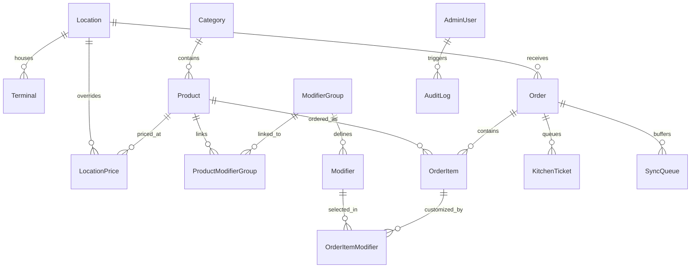

# Phase 5: Database Architecture, Fiscal Integrity & Security
## Documentation Guide (`documentations/PHASE_5_DATABASE_FISCAL_INTEGRITY_AND_SECURITY.md`)

> **Goal:** Establish a rock-solid, tamper-proof backend with embedded SQLite WAL concurrency, zero-trust server validation, Cyprus 19% VAT compliance, and native thermal hardware drivers.

---

## 🎯 1. Simple Summary (For Everyone)

To make sure the restaurant never suffers financial losses or security vulnerabilities, we put strict security and accounting guardrails in place:
1. **No Internet Dependency:** The database lives directly on the restaurant's local computer. If the internet goes down, orders and receipts keep printing without a hitch.
2. **Anti-Hacking (Zero-Trust):** If someone tries to hack the kiosk screen or alter the price of a döner from €6.50 to €0.01, the server rejects it. The system always looks up the real price in the database.
3. **Cyprus Tax Compliance:** Every sale automatically separates the standard **19% Cyprus VAT** from net sales, keeping the company's books 100% ready for tax audits and accountants.
4. **Staff PIN Security:** Staff log into registers with 4-digit PINs. If someone tries to guess a PIN 5 times in a row, the screen locks for 5 minutes and alerts management.
5. **Universal Printer Drivers:** Works out-of-the-box with standard commercial Epson TM and Star Micronics thermal receipt printers and automatically pops the cash drawer.

---

## 🔬 2. Technical Deep Dive (For Engineers)

### Database Schema Entity-Relationship Diagram (15 Prisma Models)



---

### Zero-Trust Server-Side Pricing Perimeter

```mermaid
graph TD
    Client[Kiosk Client] -->|Sends productId & modifierIds only| ServerAPI[/api/orders/create]
    Client -.->|Ignored: Any client-sent prices| Trash[Disregarded]
    
    ServerAPI --> DB[(SQLite WAL Database)]
    DB -->|Fetch basePrice, modifier priceAdjustments| ServerAPI
    
    ServerAPI --> CALC[Server-Side Price Recalculation Engine]
    CALC --> VAT[Derive Net Subtotal & 19% VAT]
    VAT --> WRITE[Write Order & KitchenTicket to DB]
```

### Cyprus Fiscal Mathematical Formulas

In the Republic of Cyprus, restaurant retail prices are quoted gross (inclusive of the standard 19% VAT rate):

$$\text{Gross Total} = \sum (\text{Base Price} + \text{Modifiers} + \text{Meal Addon}) \times \text{Quantity} - \text{Discounts}$$

$$\text{Net Subtotal (Taxable Base)} = \frac{\text{Gross Total}}{1.19}$$

$$\text{Cyprus VAT Amount (19\%)} = \text{Gross Total} - \text{Net Subtotal}$$

---

### Thermal Printer & Cash Drawer Hardware Protocol

```typescript
// Epson TM Series (ESC/POS Raw Binary Driver)
const ESC = "\x1B";
const GS = "\x1D";

// Initialize Printer
const CMD_INIT = ESC + "@";

// Cut Paper (Full Cut)
const CMD_CUT = GS + "V\x00";

// RJ12 Cash Drawer Solenoid Kick (Pin 2, 50ms pulse)
const CMD_DRAWER_KICK = ESC + "p\x00\x19\xFA";

// Star Micronics Series (StarPRNT Driver)
const STAR_INIT = "\x1B\x40";
const STAR_CUT = "\x1B\x64\x02";
const STAR_DRAWER_KICK = "\x07"; // Bel character triggers drawer solenoid
```

---

## 📦 Phase 5 Deliverables
* Complete schema in [`prisma/schema.prisma`](file:///Users/saiedsagar/DEVELOPER/DEVELOPER/MYGD/prisma/schema.prisma).
* Database seeding script in [`prisma/seed.ts`](file:///Users/saiedsagar/DEVELOPER/DEVELOPER/MYGD/prisma/seed.ts).
* Zero-trust API validation in [`src/app/api/orders/create/route.ts`](file:///Users/saiedsagar/DEVELOPER/DEVELOPER/MYGD/src/app/api/orders/create/route.ts).
* Thermal printer driver layer in [`src/app/api/terminal/printer-test/route.ts`](file:///Users/saiedsagar/DEVELOPER/DEVELOPER/MYGD/src/app/api/terminal/printer-test/route.ts).
