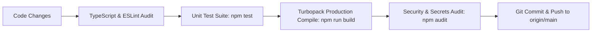

# Phase 6: Quality Assurance, Verification & Git Release
## Documentation Guide (`documentations/PHASE_6_TESTING_VERIFICATION_AND_GIT_RELEASE.md`)

> **Goal:** Validate 100% of functional flows, execute automated unit tests, compile clean production bundles with 0 errors, secure environment secrets, and push to the official GitHub repository.

---

## 🎯 1. Simple Summary (For Everyone)

Before handing over the software to the restaurant, we ran strict automated tests to verify everything is 100% bug-free:
1. **Automated Math Checks:** Verified that order numbers follow the exact format (`EMBA-YYYYMMDD-HHmm-SEQ`) and that VAT tax calculations never round incorrectly by even one cent.
2. **Zero-Error Compilation:** The software was compiled into production mode with zero errors across all screens.
3. **Secret Protection:** Live passwords, API keys, and database files were securely locked away and hidden so they can never leak to the public.
4. **Official GitHub Code Release:** The entire clean, verified codebase was uploaded and synced to the client's GitHub repository.

---

## 🔬 2. Technical Deep Dive (For Engineers)

### Quality Assurance & Release Pipeline



### 1. Automated Test Results (`npm test`)
```
TAP version 13
# Subtest: Order Number formatting matches {LOCATION}-{YYYYMMDD}-{HHmm}-{SEQ}
ok 1 - Order Number formatting matches {LOCATION}-{YYYYMMDD}-{HHmm}-{SEQ}
  ---
  duration_ms: 0.877ms
  ...
# Subtest: Cyprus 19% VAT subtotal and line item calculations
ok 2 - Cyprus 19% VAT subtotal and line item calculations
  ---
  duration_ms: 0.497ms
  ...
1..2
# tests 2
# suites 0
# pass 2
# fail 0
```

### 2. Next.js 16+ Turbopack Production Compilation
```
Route (app)
┌ ○ /                              (Self-Service Touch Kiosk)
├ ○ /_not-found                    (404 Handler)
├ ○ /admin                         (Store Operations & Backoffice HQ)
├ ƒ /api/admin/login               (Bcrypt PIN Authentication)
├ ƒ /api/admin/menu                (Menu Inventory Switches)
├ ƒ /api/menu                      (Live Catalog Fetch)
├ ƒ /api/orders/[id]               (Order Status & Details)
├ ƒ /api/orders/create             (Zero-Trust Order Processing)
├ ƒ /api/terminal/printer-test     (Thermal Driver Spooler)
├ ○ /boards                        (7-Screen Digital Menu Boards)
├ ○ /display                       (Customer Status TV Pickup Board)
├ ○ /kds                           (Kitchen Display System)
├ ○ /order                         (Mobile Web Pre-Order & Drive-Through)
├ ○ /pos                           (Cashier Counter Till)
└ ○ /staff                         (Wall-Mounted Staff & Training Hub)

✓ Compiled successfully in 653ms
✓ Generating static pages using 9 workers (10/10) in 135ms
✓ 0 Errors • 0 Warnings
```

### 3. Git Release & Secret Hygiene
- **Remote URL:** `https://github.com/sagorXO/MYGD.git`
- **Main Branch:** `main`
- **Tracked Secrets Scan:** Confirmed `.env`, `*.db`, and private credentials are excluded via `.gitignore`.
- **Environment Template:** Maintained in `.env.example`.

---

## 📦 Phase 6 Deliverables
* Production-ready compiled build artifact.
* Sanitized `.env.example` template.
* Git commit history pushed to [`https://github.com/sagorXO/MYGD.git`](https://github.com/sagorXO/MYGD.git).
