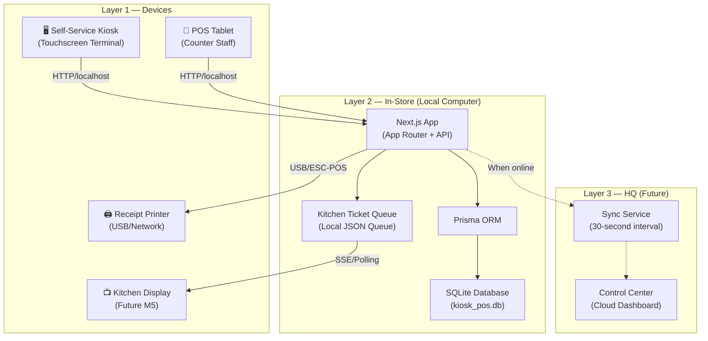
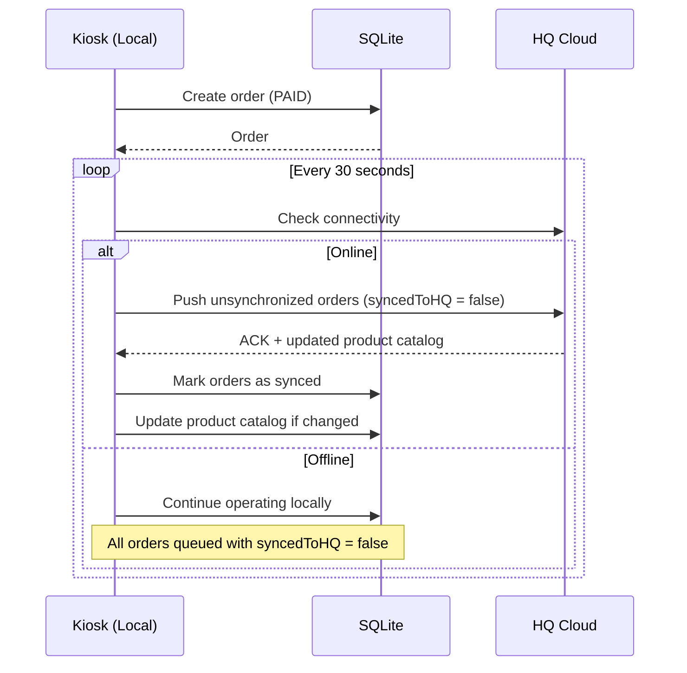
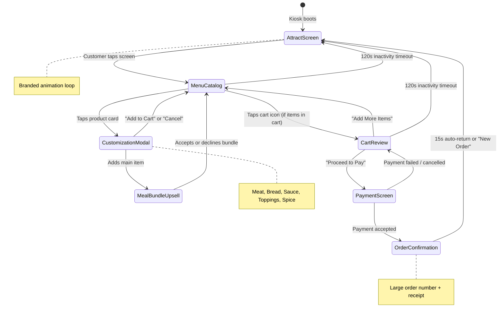

# MY GERMAN DÖNER — Kiosk / POS System
## Phase 1: Product Requirements Document & Technical Architecture

---

## 1. Executive Summary

This document defines the complete product requirements for the **MY GERMAN DÖNER Self-Service Kiosk & POS** application — a touchscreen-first ordering terminal deployed on-premise in fast-casual döner restaurants across Cyprus (Emba/Paphos, Limassol, and future locations).

The system maps to **Module M4 (POS/Till)** from the [MYGD Control System Developer Brief](file:///Users/saiedsagar/DEVELOPER/DEVELOPER/MYGD/Requirements/MYGD%20Control%20System%20Developer%20Brief%20EN.pdf), with forward-compatible hooks for **M5 (Kitchen Display)** and **M11 (Product & Price Database)**.

### Core Design Principles (from Developer Brief)
1. **Single Source of Truth** — Products, prices, and recipes live in exactly one place. Every module reads from it.
2. **Offline Resilience** — The in-store layer must keep the till, printer, and kitchen display working with **no internet connection**.
3. **Multi-Location from Day One** — Data model supports per-location pricing/config and cross-location reporting.

---

## 2. Scope & Boundaries

### In Scope (This Build)
| Feature | Description |
|:--------|:------------|
| **Attract Screen** | Full-screen branded idle animation that draws customers to the kiosk |
| **Menu Catalog** | Grid-based product browsing by category with high-impact food visuals |
| **Item Customization** | Meat type, bread selection, sauce toggles, topping toggles, spice level, meal bundle upsell |
| **Cart Management** | Slide-up tray with quantity adjustment, item removal, order notes |
| **Payment Simulation** | Cash / Card / NFC wallet selection with amount display (real terminal integration deferred) |
| **Order Confirmation** | Order number display with estimated wait time |
| **Kitchen Ticket Generation** | Structured JSON ticket pushed to kitchen display queue + thermal receipt data |
| **Local Database** | SQLite with full product catalog, order history, terminal config — works offline |
| **Multi-Location Config** | Per-location pricing, currency (EUR for Cyprus), tax rate, branding overrides |
| **Docker Deployment** | Single `docker compose up` to run the full stack on store hardware |

### Out of Scope (Future Modules)
| Feature | Reason |
|:--------|:-------|
| Real payment terminal integration | Requires hardware-specific SDK (deferred to integration phase) |
| Kitchen Display System (M5) | Separate module — this build outputs kitchen tickets to a queue |
| Online pre-ordering (M6) | Requires M5 to be operational first |
| HQ Control Center (Layer 3) | Separate cloud deployment |
| Inventory deduction (M3) | Phase 5 — schema is forward-compatible |
| Menu board management (M10) | Phase 6 — separate display system |

---

## 3. User Personas & Stories

### Persona 1: Walk-In Customer (Primary)
A hungry customer approaching the self-service kiosk in a MY GERMAN DÖNER restaurant. They want to order quickly, customize their döner, pay, and receive an order number.

### Persona 2: Counter Staff / Cashier
Uses the same interface in POS mode (tablet on stand) to take orders for customers who prefer human interaction.

### Persona 3: Store Manager
Configures the terminal, views daily order history, and manages product availability.

---

### User Stories

#### Epic 1: Ordering Flow
| ID | Story | Acceptance Criteria |
|:---|:------|:-------------------|
| US-01 | As a customer, I want to see an inviting attract screen so I know the kiosk is available | Screen shows brand animation, "TAP TO ORDER" prompt, auto-returns after 60s inactivity |
| US-02 | As a customer, I want to browse the menu by category so I can find what I want quickly | Categories displayed as horizontal scrollable tabs; products in responsive grid cards |
| US-03 | As a customer, I want to see large food images and clear prices so I can decide confidently | Product cards show name, image, price, and brief description; minimum 120px card height |
| US-04 | As a customer, I want to customize my döner (meat, bread, sauce, toppings, spice) so I get exactly what I want | Customization modal with toggle chips, radio groups, and a visual spice meter |
| US-05 | As a customer, I want to add a meal bundle (drink + side) so I save money | Upsell prompt after adding main item; shows savings amount |
| US-06 | As a customer, I want to review my cart before paying so I can make changes | Slide-up cart tray showing all items with quantity +/- controls and remove button |
| US-07 | As a customer, I want to pay and receive an order number so I know when my food is ready | Payment method selection → confirmation screen with large order number |

#### Epic 2: Kitchen Integration
| ID | Story | Acceptance Criteria |
|:---|:------|:-------------------|
| US-08 | As kitchen staff, I want to see incoming orders with all customizations so I can prepare them correctly | Kitchen ticket includes: order #, timestamp, each item with all modifiers, special notes |
| US-09 | As kitchen staff, I want orders queued locally so they're not lost if internet drops | Orders stored in SQLite; kitchen queue reads from local DB |

#### Epic 3: Terminal Management
| ID | Story | Acceptance Criteria |
|:---|:------|:-------------------|
| US-10 | As a manager, I want to mark products as unavailable so customers don't order sold-out items | Toggle availability per product; unavailable items shown greyed out or hidden |
| US-11 | As a manager, I want to configure the terminal (name, tax rate, receipt header) | Settings panel accessible via manager PIN |
| US-12 | As a manager, I want to view today's order history and totals | Simple daily summary: order count, total revenue, payment method breakdown |

---

## 4. Menu Data Model — MY GERMAN DÖNER Products

### Categories & Products

| Category | Products | Base Price (EUR) |
|:---------|:---------|:----------------|
| **Döner Kebab** | Classic Döner, Döner with Cheese, Döner Spezial, Veggie Döner | €6.50 – €8.50 |
| **Döner Box** | Classic Box, Box Spezial, Veggie Box | €7.00 – €9.00 |
| **Durum** | Classic Durum, Durum Spezial, Veggie Durum | €7.50 – €9.50 |
| **Lahmacun** | Classic Lahmacun, Lahmacun mit Käse | €6.00 – €7.50 |
| **Currywurst** | Classic Currywurst, Currywurst Pommes | €5.50 – €7.00 |
| **Sides** | Pommes Frites, Halloumi Fries, Mixed Salad, Hummus & Bread | €3.00 – €5.00 |
| **Drinks** | Ayran, Cola, Fanta, Sprite, Water, Uludag Gazoz | €2.00 – €3.50 |
| **Sauces (Extra)** | Kräuter (Herb), Knoblauch (Garlic), Scharf (Hot), Cocktail, Tzatziki | €0.50 each |

### Customization Options

| Modifier Group | Type | Options |
|:---------------|:-----|:--------|
| **Meat** | Radio (single select) | Chicken, Beef/Lamb, Mixed, Veggie Falafel |
| **Bread** | Radio (single select) | Fladenbrot (Flatbread), Dürüm Wrap, Lahmacun Base, Bread Roll |
| **Sauces** | Checkbox (multi-select, max 3) | Kräuter, Knoblauch, Scharf, Cocktail, Tzatziki |
| **Toppings** | Checkbox (multi-select) | Lettuce, Tomato, Onion, Red Cabbage, Corn, Jalapeño (+€0.50), Extra Cheese (+€1.00) |
| **Spice Level** | Slider (1-5) | Mild → Medium → Scharf → Extra Scharf → Hölle 🔥 |
| **Meal Bundle** | Toggle upsell | Add Drink + Side for €3.50 (saves ~€1.50) |

---

## 5. Technical Architecture

### 5.1 System Layers (Aligned with Developer Brief)



### 5.2 Technology Stack

| Layer | Technology | Purpose |
|:------|:-----------|:--------|
| **Frontend** | Next.js 15 (App Router) | SSR + Client Components for kiosk UI |
| **Styling** | Tailwind CSS 3.4 | Design tokens, responsive kiosk layouts |
| **Animation** | Framer Motion 11 | Touch feedback, page transitions, cart animations |
| **Icons** | Lucide React | Clean, consistent iconography |
| **State** | Zustand | Lightweight client-side cart & order state |
| **Backend** | Next.js API Routes | Order processing, kitchen ticket generation |
| **ORM** | Prisma 6 | Type-safe database access |
| **Database** | SQLite 3 | Zero-config embedded database, offline-first |
| **Runtime** | Node.js 20 LTS | Server runtime |
| **Container** | Docker + Docker Compose | On-premise deployment |
| **Fonts** | Space Grotesk + JetBrains Mono | Brand typography + receipt rendering |

### 5.3 Docker Architecture

```yaml
# docker-compose.yml (Blueprint)
version: "3.9"

services:
  kiosk-app:
    build:
      context: .
      dockerfile: Dockerfile
    container_name: mygd-kiosk
    restart: unless-stopped
    ports:
      - "3000:3000"     # Kiosk UI
      - "3001:3001"     # Kitchen Display (future)
    volumes:
      - kiosk-data:/app/prisma/data    # Persistent SQLite DB
      - /dev/usb:/dev/usb:rw           # Receipt printer access
    environment:
      - NODE_ENV=production
      - DATABASE_URL=file:/app/prisma/data/kiosk_pos.db
      - TERMINAL_ID=EMBA-K01
      - LOCATION_ID=emba-paphos
      - CURRENCY=EUR
      - TAX_RATE=0.19
      - RECEIPT_PRINTER=/dev/usb/lp0
    healthcheck:
      test: ["CMD", "curl", "-f", "http://localhost:3000/api/health"]
      interval: 30s
      timeout: 5s
      retries: 3

volumes:
  kiosk-data:
    driver: local
```

```dockerfile
# Dockerfile (Blueprint)
FROM node:20-alpine AS base

# Install dependencies
FROM base AS deps
WORKDIR /app
COPY package.json package-lock.json ./
RUN npm ci --omit=dev

# Build application
FROM base AS builder
WORKDIR /app
COPY --from=deps /app/node_modules ./node_modules
COPY . .
RUN npx prisma generate
RUN npm run build

# Production image
FROM base AS runner
WORKDIR /app
ENV NODE_ENV=production
RUN addgroup --system --gid 1001 nodejs
RUN adduser --system --uid 1001 nextjs
COPY --from=builder /app/public ./public
COPY --from=builder /app/.next/standalone ./
COPY --from=builder /app/.next/static ./.next/static
COPY --from=builder /app/prisma ./prisma
COPY --from=builder /app/node_modules/.prisma ./node_modules/.prisma

USER nextjs
EXPOSE 3000
CMD ["sh", "-c", "npx prisma migrate deploy && node server.js"]
```

### 5.4 Database Schema (Enhanced for MYGD)

```prisma
// prisma/schema.prisma

datasource db {
  provider = "sqlite"
  url      = env("DATABASE_URL")
}

generator client {
  provider = "prisma-client-js"
}

// ─── Location & Terminal ───────────────────────────────
model Location {
  id           String          @id @default(uuid())
  slug         String          @unique  // "emba-paphos", "limassol"
  name         String                   // "MY GERMAN DÖNER — Emba"
  address      String?
  currency     String          @default("EUR")
  taxRate      Float           @default(0.19)
  isActive     Boolean         @default(true)
  terminals    Terminal[]
  prices       LocationPrice[]
  orders       Order[]
  createdAt    DateTime        @default(now())
  updatedAt    DateTime        @updatedAt
}

model Terminal {
  id           String   @id @default(uuid())
  locationId   String
  location     Location @relation(fields: [locationId], references: [id])
  name         String   @default("Kiosk-01")
  type         String   @default("KIOSK")  // KIOSK | POS_COUNTER | DRIVE_THROUGH
  isLocked     Boolean  @default(false)
  receiptHeader String  @default("MY GERMAN DÖNER\nDanke für Ihre Bestellung!")
  orders       Order[]
  createdAt    DateTime @default(now())
  updatedAt    DateTime @updatedAt

  @@index([locationId])
}

// ─── Product Catalog (M11 — Single Source of Truth) ────
model Category {
  id           String    @id @default(uuid())
  name         String                   // "Döner Kebab", "Drinks"
  nameDE       String?                  // German name
  slug         String    @unique
  icon         String?                  // Lucide icon name or SVG path
  displayRank  Int       @default(0)
  isActive     Boolean   @default(true)
  products     Product[]
  createdAt    DateTime  @default(now())
  updatedAt    DateTime  @updatedAt
}

model Product {
  id           String           @id @default(uuid())
  categoryId   String
  category     Category         @relation(fields: [categoryId], references: [id], onDelete: Cascade)
  name         String                   // "Classic Döner"
  nameDE       String?                  // "Klassischer Döner"
  description  String?
  basePrice    Float                    // Default price (can be overridden per location)
  imageUrl     String?
  barcode      String?          @unique
  isAvailable  Boolean          @default(true)
  isPopular    Boolean          @default(false)
  calorieCount Int?
  allergens    String?                  // Comma-separated: "gluten,dairy,nuts"
  displayRank  Int              @default(0)
  modifierGroups ProductModifierGroup[]
  locationPrices LocationPrice[]
  orderItems   OrderItem[]
  createdAt    DateTime         @default(now())
  updatedAt    DateTime         @updatedAt

  @@index([categoryId])
  @@index([isAvailable])
}

model LocationPrice {
  id         String   @id @default(uuid())
  locationId String
  location   Location @relation(fields: [locationId], references: [id])
  productId  String
  product    Product  @relation(fields: [productId], references: [id])
  price      Float
  createdAt  DateTime @default(now())
  updatedAt  DateTime @updatedAt

  @@unique([locationId, productId])
}

// ─── Customization & Modifiers ─────────────────────────
model ModifierGroup {
  id           String    @id @default(uuid())
  name         String              // "Meat Choice", "Sauce Selection"
  nameDE       String?
  type         String              // RADIO | CHECKBOX | SLIDER
  minSelect    Int       @default(0)
  maxSelect    Int       @default(1)  // For CHECKBOX: max toppings allowed
  isRequired   Boolean   @default(false)
  displayRank  Int       @default(0)
  modifiers    Modifier[]
  products     ProductModifierGroup[]
  createdAt    DateTime  @default(now())
  updatedAt    DateTime  @updatedAt
}

model Modifier {
  id              String        @id @default(uuid())
  groupId         String
  group           ModifierGroup @relation(fields: [groupId], references: [id], onDelete: Cascade)
  name            String                // "Chicken", "Knoblauch Sauce"
  nameDE          String?
  priceAdjustment Float         @default(0)  // +€0.50 for jalapeños, etc.
  isDefault       Boolean       @default(false)
  isAvailable     Boolean       @default(true)
  displayRank     Int           @default(0)
  orderItemModifiers OrderItemModifier[]
  createdAt       DateTime      @default(now())
  updatedAt       DateTime      @updatedAt

  @@index([groupId])
}

model ProductModifierGroup {
  id              String        @id @default(uuid())
  productId       String
  product         Product       @relation(fields: [productId], references: [id], onDelete: Cascade)
  modifierGroupId String
  modifierGroup   ModifierGroup @relation(fields: [modifierGroupId], references: [id], onDelete: Cascade)
  displayRank     Int           @default(0)

  @@unique([productId, modifierGroupId])
}

// ─── Orders ────────────────────────────────────────────
model Order {
  id            String      @id @default(uuid())
  orderNumber   Int         @default(autoincrement())
  locationId    String
  location      Location    @relation(fields: [locationId], references: [id])
  terminalId    String
  terminal      Terminal    @relation(fields: [terminalId], references: [id])
  status        String      @default("PENDING")
  // PENDING → PAID → PREPARING → READY → COMPLETED → CANCELLED
  paymentMethod String      // CASH | CARD | NFC_WALLET
  subtotal      Float
  taxAmount     Float
  totalAmount   Float
  customerNote  String?
  items         OrderItem[]
  kitchenTicket KitchenTicket?
  syncedToHQ    Boolean     @default(false)
  createdAt     DateTime    @default(now())
  updatedAt     DateTime    @updatedAt

  @@index([locationId, status])
  @@index([terminalId])
  @@index([createdAt])
  @@index([syncedToHQ])
}

model OrderItem {
  id         String              @id @default(uuid())
  orderId    String
  order      Order               @relation(fields: [orderId], references: [id], onDelete: Cascade)
  productId  String
  product    Product             @relation(fields: [productId], references: [id])
  quantity   Int                 @default(1)
  unitPrice  Float
  totalPrice Float
  notes      String?
  modifiers  OrderItemModifier[]

  @@index([orderId])
}

model OrderItemModifier {
  id         String   @id @default(uuid())
  orderItemId String
  orderItem  OrderItem @relation(fields: [orderItemId], references: [id], onDelete: Cascade)
  modifierId String
  modifier   Modifier  @relation(fields: [modifierId], references: [id])
  name       String              // Denormalized for receipt printing
  priceAdj   Float    @default(0)

  @@index([orderItemId])
}

// ─── Kitchen ───────────────────────────────────────────
model KitchenTicket {
  id          String   @id @default(uuid())
  orderId     String   @unique
  order       Order    @relation(fields: [orderId], references: [id])
  status      String   @default("QUEUED")
  // QUEUED → IN_PROGRESS → READY → PICKED_UP
  claimedBy   String?           // Staff name who claimed it
  startedAt   DateTime?
  completedAt DateTime?
  createdAt   DateTime @default(now())
  updatedAt   DateTime @updatedAt

  @@index([status])
}
```

### 5.5 Application Routing Structure

```
app/
├── (kiosk)/                        # Route group: customer-facing kiosk
│   ├── layout.tsx                  # Kiosk chrome: full-screen, no browser UI
│   ├── page.tsx                    # Attract screen (idle / "Tap to Order")
│   ├── menu/
│   │   └── page.tsx                # Menu catalog with category tabs
│   ├── customize/
│   │   └── [productId]/
│   │       └── page.tsx            # Item customization modal
│   ├── cart/
│   │   └── page.tsx                # Cart review & checkout
│   ├── payment/
│   │   └── page.tsx                # Payment method selection
│   └── confirmation/
│       └── [orderId]/
│           └── page.tsx            # Order confirmation + number
│
├── (admin)/                        # Route group: manager panel
│   ├── layout.tsx                  # Admin chrome with PIN gate
│   ├── dashboard/
│   │   └── page.tsx                # Daily summary
│   ├── products/
│   │   └── page.tsx                # Toggle availability
│   └── settings/
│       └── page.tsx                # Terminal configuration
│
├── api/
│   ├── health/route.ts             # Docker healthcheck endpoint
│   ├── orders/
│   │   ├── route.ts                # POST: create order, GET: list orders
│   │   └── [id]/route.ts           # GET/PATCH single order
│   ├── products/
│   │   └── route.ts                # GET: product catalog
│   ├── kitchen/
│   │   ├── tickets/route.ts        # GET: active tickets, POST: claim
│   │   └── sse/route.ts            # SSE: real-time ticket stream
│   └── terminal/
│       └── config/route.ts         # GET/PUT terminal config
│
├── layout.tsx                      # Root layout (fonts, meta, providers)
├── globals.css                     # Tailwind base + brand tokens
└── not-found.tsx                   # 404 fallback
```

---

## 6. Edge Cases & Failure Handling

### 6.1 Hardware Failures

| Failure | Detection | Graceful Response |
|:--------|:----------|:-----------------|
| **Internet down** | Periodic ping to HQ fails | All operations continue locally. Orders queue for sync. Badge shows "OFFLINE" |
| **Receipt printer disconnected** | USB/network heartbeat timeout | Show order number on screen with large font. Staff verbally confirms. Log error |
| **Receipt printer paper out** | Printer status query (ESC/POS) | Alert on kiosk: "Receipt printing unavailable — your order number is displayed" |
| **Touchscreen unresponsive** | No touch events for 5+ minutes during active hours | Auto-restart kiosk app via Docker healthcheck |
| **Power loss** | N/A (hardware UPS recommended) | SQLite WAL mode ensures no data corruption. On restart: resume from last committed state |
| **Database corruption** | Prisma connection error on startup | Auto-backup on each successful boot. Restore from last backup. Alert manager |

### 6.2 Application Edge Cases

| Scenario | Handling |
|:---------|:---------|
| **Customer abandons mid-order** | 120s inactivity timeout → save partial order as ABANDONED → return to attract screen |
| **Same item added twice with different customizations** | Each customization creates a unique cart line item |
| **Product marked unavailable mid-order** | If item already in cart: show toast "Item no longer available, removed from cart" |
| **Concurrent orders from multiple terminals** | SQLite WAL mode + Prisma transactions ensure order number uniqueness |
| **Order number overflow** | Auto-increment resets daily at midnight (order numbers are day-scoped: e.g., #001-#999) |
| **Maximum cart size** | Cap at 20 items per order to prevent abuse |
| **Price change during active session** | Prices locked at time of add-to-cart; cart total reflects locked prices |
| **Currency/locale** | EUR with German number formatting (€7,50) for Cyprus operation |

### 6.3 Offline Sync Strategy



---

## 7. UI/UX Interaction Flow



---

## 8. Design Tokens (Brand System)

| Token | Value | Usage |
|:------|:------|:------|
| `--color-charcoal` | `#1A1A1A` | Primary background, headers, navigation |
| `--color-signal-orange` | `#FF5722` | CTA buttons, price highlights, active states |
| `--color-white` | `#FFFFFF` | Text on dark, card backgrounds, contrast |
| `--color-doner-gold` | `#E5A93C` | Accent, "Popular" badges, meal bundle highlights |
| `--color-surface` | `#2A2A2A` | Card surfaces, elevated panels |
| `--color-surface-light` | `#3A3A3A` | Input fields, toggles, secondary surfaces |
| `--color-success` | `#4CAF50` | Order confirmed, "Added to cart" toast |
| `--color-danger` | `#E53935` | Remove item, error states, "Scharf" indicator |
| `--font-primary` | `Space Grotesk` | Headlines, product names, buttons |
| `--font-receipt` | `JetBrains Mono` | Receipt rendering, order numbers, prices |
| `--radius-card` | `16px` | Product cards, modals |
| `--radius-button` | `12px` | All interactive buttons |
| `--touch-target-min` | `56px` | Minimum touch target (accessibility) |
| `--touch-target-primary` | `64px` | Primary action buttons |

---

## 9. Feature Checklist

### Core Infrastructure
- [ ] Next.js 15 project with App Router, TypeScript strict mode
- [ ] Tailwind CSS with MYGD brand tokens configured
- [ ] Prisma ORM with SQLite, full schema as specified above
- [ ] Docker Compose + Dockerfile for on-premise deployment
- [ ] Seed script with complete MYGD menu data
- [ ] Zustand store for cart, customization, and kiosk state
- [ ] Health check API endpoint
- [ ] Environment configuration (location, terminal, currency, tax)

### Kiosk Screens
- [ ] **Attract Screen** — Full-screen branded animation with "TAP TO ORDER"
- [ ] **Menu Catalog** — Category tabs + product grid with search/filter
- [ ] **Customization Modal** — Meat/Bread/Sauce/Toppings/Spice selector
- [ ] **Meal Bundle Upsell** — Post-add prompt for drink + side combo
- [ ] **Cart Tray** — Slide-up panel with item management
- [ ] **Payment Screen** — Method selection + amount display
- [ ] **Order Confirmation** — Large order number + auto-return countdown

### Kitchen Integration
- [ ] Kitchen ticket JSON generation from order data
- [ ] Kitchen ticket queue with SSE real-time push
- [ ] Ticket status management (QUEUED → IN_PROGRESS → READY)

### Manager Panel
- [ ] PIN-protected admin access
- [ ] Daily order summary dashboard
- [ ] Product availability toggle
- [ ] Terminal configuration editor

### Offline & Resilience
- [ ] SQLite WAL mode for crash safety
- [ ] Offline operation detection with visual indicator
- [ ] Order sync queue (syncedToHQ flag)
- [ ] Inactivity timeout (120s → attract screen)
- [ ] Receipt printer error handling with fallback display
- [ ] Daily order number reset logic

### Polish & UX
- [ ] Framer Motion page transitions (AnimatePresence)
- [ ] Touch feedback animations (whileTap spring)
- [ ] Product card → customization layoutId morphing
- [ ] Cart item add/remove animations
- [ ] Loading states with skeleton screens
- [ ] Error boundaries per route segment
- [ ] Responsive: portrait kiosk (1080×1920) + landscape POS tablet

---

## 10. Non-Functional Requirements

| Requirement | Target |
|:------------|:-------|
| **Cold boot to operational** | < 15 seconds |
| **Order submission latency** | < 500ms (local SQLite) |
| **Touch response time** | < 100ms visual feedback |
| **Uptime** | 99.9% (Docker restart policy) |
| **Offline tolerance** | Unlimited (until disk full) |
| **Max concurrent sessions** | 1 per terminal (single-user kiosk) |
| **Database backup** | Auto-backup on boot + daily at 03:00 |
| **Memory footprint** | < 512MB RAM |

---

> [!IMPORTANT]
> ## User Review Required
> 
> Please review the following before I proceed to **Phase 2 (UI/UX Design)**:
> 
> 1. **Menu accuracy** — Are the product categories, items, and customization options correct for MY GERMAN DÖNER? Any missing items or pricing adjustments?
> 2. **Cyprus tax rate** — I've set 19% VAT. Is this correct for your operation?
> 3. **Currency formatting** — EUR with German-style comma decimals (€7,50)?
> 4. **Payment methods** — Currently: Cash, Card, NFC Wallet. Should QR code payment be included?
> 5. **Receipt printer** — What model/brand? ESC/POS thermal (Epson TM series, Star Micronics)?
> 6. **Order number format** — Daily reset (#001–#999) or continuous?
> 7. **Languages** — English only, or bilingual (English + German/Greek)?
> 8. **Kiosk hardware** — What screen size/resolution? Portrait 1080×1920 assumed.
> 9. **Scope confirmation** — Are you comfortable with the in-scope / out-of-scope boundaries?
> 10. **Anything missing** from the developer brief that should be incorporated into the kiosk build?
